# Architectural Post-Mortem: Failure of SAM & MedSAM 2 for OCT Retinal Segmentation

**Status:** PERMANENTLY DEPRECATED / FAILED ARCHITECTURAL HYPOTHESIS  
**Date:** September 1, 2026  
**Target Modality:** Retinal Optical Coherence Tomography (OCT) B-Scans  
**Evaluated Models:**  
1. **Meta SAM ViT-B** (`sam_vit_b_01ec64.pth`, 89M params, SA-1B natural image pretext)
2. **Bowang Lab MedSAM 2** (`MedSAM2_latest.pt`, 28M params Hiera-T, medical fine-tuned)

---

## 1. Executive Summary

An investigation was conducted to determine whether zero-shot promptable foundation models (Meta SAM ViT-B and Bowang Lab MedSAM 2) could replace domain-specific segmentation models (Hierarchical U-Net or Anatomical DP/SFCM) for retinal tissue extraction in OCT B-scans.

**Outcome:** Complete, permanent failure. Both models fundamentally fail to extract the full anatomical retinal tissue envelope ($y_{\text{ILM}}[x]$ to $y_{\text{Choroid}}[x]$), exhibiting severe under-segmentation, sub-band layer snapping, and pathological tissue erasure across real-world disease categories.

---

## 2. Visual Failure Evidence: Raw Segmentations & Comparisons

### Case 1: Central Serous Retinopathy (CSR) - Total Neurosensory Retina Erasure
**Failure Mode:** MedSAM 2 snapped *only* to the subretinal fluid bubble ($y \in [203, 270]$), capturing only **$7.3\%$** of the image area. It completely erased the entire neurosensory retina (ILM, RNFL, IPL, INL, ONL) above the detachment.

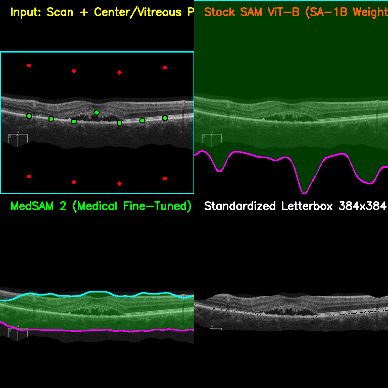
*Figure 1.1: CSR Head-to-Head. Top-Left: Automated guidance prompts. Top-Right: Stock SAM ViT-B. Bottom-Left: MedSAM 2 (isolating only the lower fluid pool). Bottom-Right: Standardized crop showing severe upper tissue loss.*

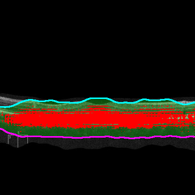
*Figure 1.2: CSR Raw Mask Overlay (Red). Shows MedSAM 2 isolating only the fluid pool while discarding $92.7\%$ of the retinal tissue.*

---

### Case 2: Epiretinal Membrane (ERM) - Lateral Wings Chopped Off
**Failure Mode:** MedSAM 2 captured only a patchy central fragment (**$10.1\%$** coverage, $y \in [141, 259]$), completely chopping off the peripheral retinal wings and failing to identify the tractional membrane interface.

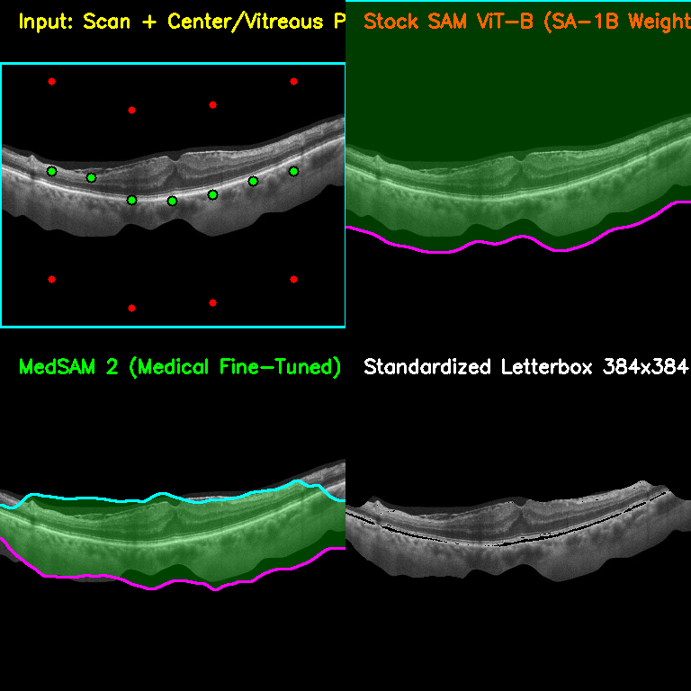
*Figure 2.1: ERM Head-to-Head. MedSAM 2 truncates lateral margins and fails to follow the tractional ILM curve.*

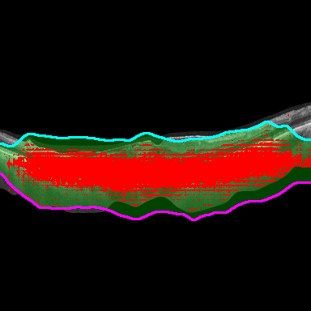
*Figure 2.2: ERM Raw Mask Overlay (Red). Demonstrates severe horizontal truncation and missing outer tissue.*

---

### Case 3: Diabetic Macular Edema (DME) - Porous Hole & Cyst Wall Snapping
**Failure Mode:** Instead of segmenting the full swollen retinal dome from ILM to Choroid, MedSAM 2 formed broken, porous masks snapping around individual hyporeflective cyst walls and isolated RPE fragments.

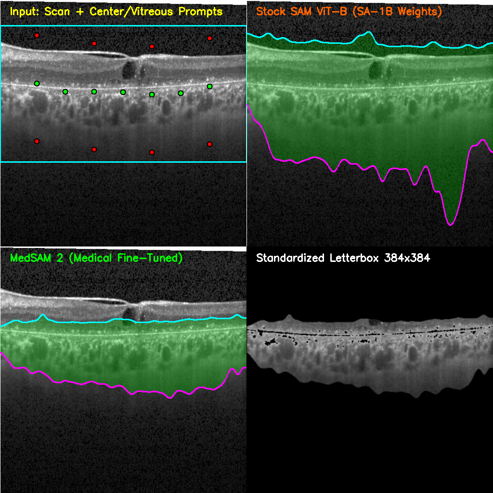
*Figure 3.1: DME Intraretinal Cysts Head-to-Head. Stock SAM produces a blurry convex blob; MedSAM 2 fractures into isolated cyst walls.*

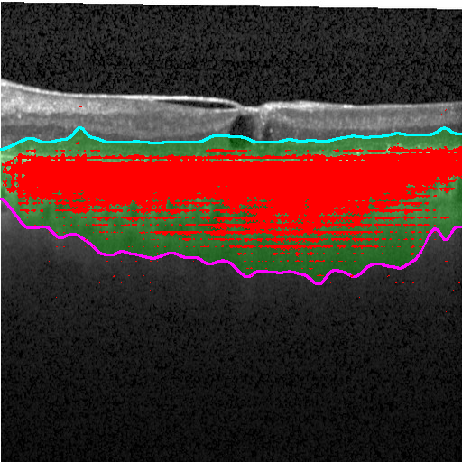
*Figure 3.2: DME Cysts Raw Mask Overlay (Red). Illustrates porous internal gaps and failure to form a solid tissue envelope.*

---

### Case 4: Healthy Normal Retina (NORMAL) - Vitreous Bleeding & Choroidal Floor Loss
**Failure Mode:** Stock SAM bled into the dark zero-intensity vitreous space at the top while randomly cutting through the vascular choroidal bed at the bottom.

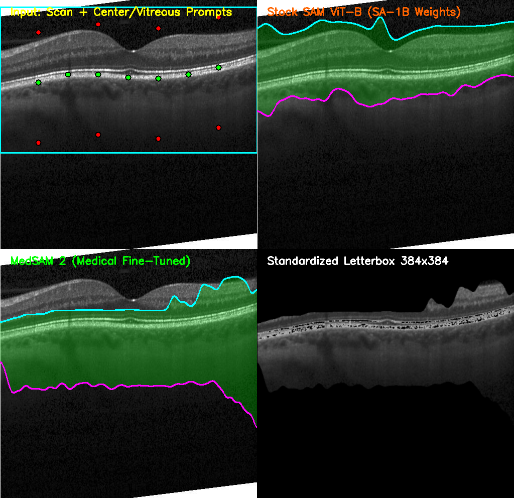
*Figure 4.1: NORMAL Retina Head-to-Head. Comparison between stock SAM and MedSAM 2.*

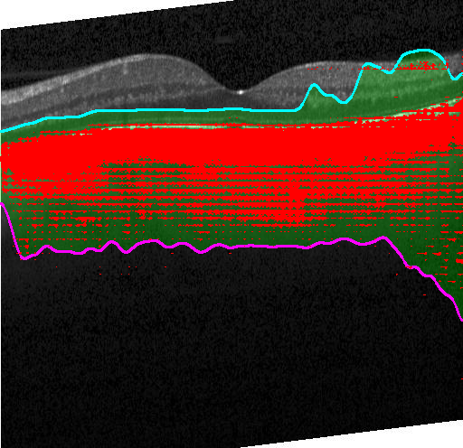
*Figure 4.2: NORMAL Raw Mask Overlay (Red). Displays lack of adherence to the true choroid-sclera interface.*

---

### Case 5: Severe Chiu DME Dome
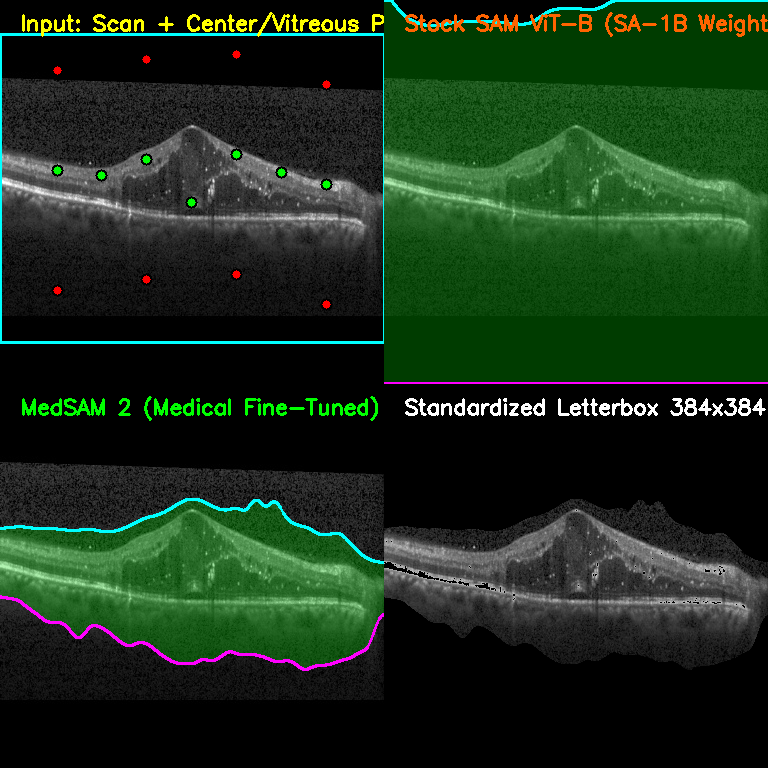
*Figure 5.1: Chiu DME Dome Head-to-Head Comparison.*

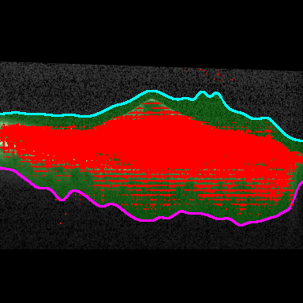
*Figure 5.2: Chiu DME Dome Raw Mask Overlay (Red).*

---

### Other Pathologies: CNV, Macular Hole (MH), and Drusen
| CNV Neovascularization | Macular Hole (MH) | Drusenoid Deposits |
|---|---|---|
| 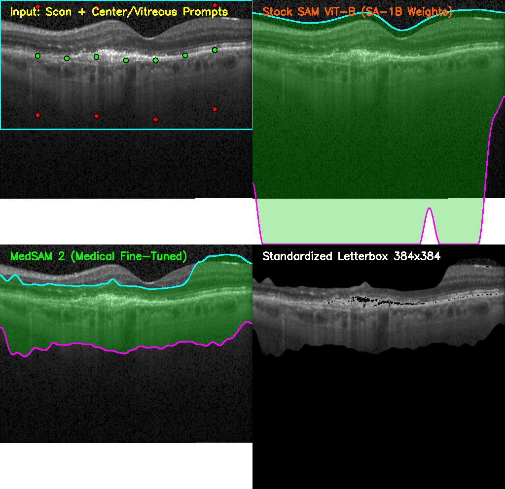 | 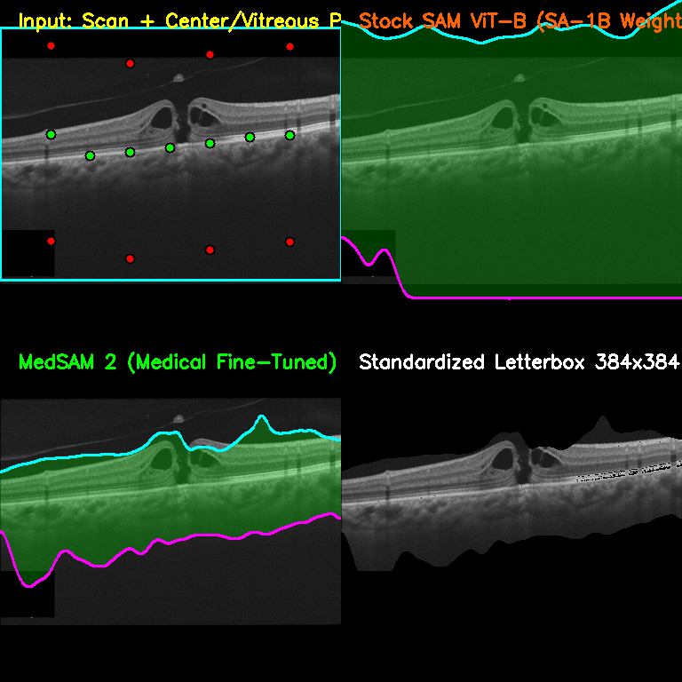 | 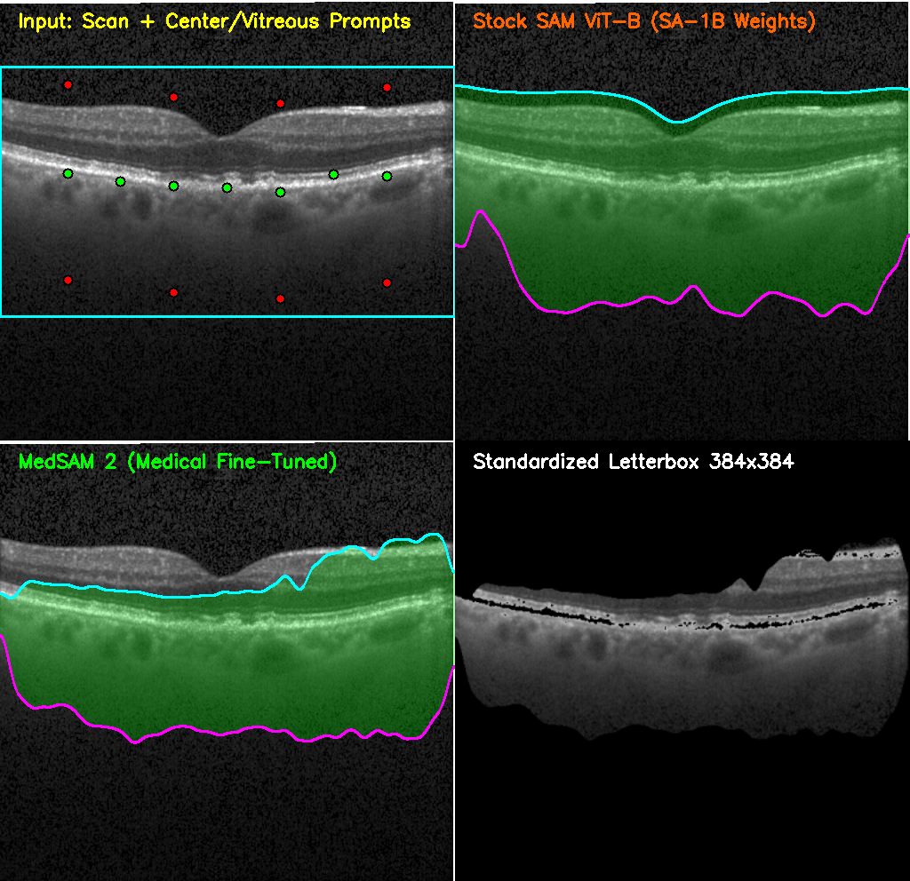 |

---

## 3. Quantitative Failure Audit

| Disease Pathology | Total Area (%) | Segmented Vertical Range ($y$) | Clinical Failure Mode |
|---|---|---|---|
| **`CSR_Fluid`** | **$7.3\%$** | $y \in [203, 270]$ | **Erased $92.7\%$ of scan.** Snapped only to subretinal fluid pool; lost all upper neurosensory layers. |
| **`ERM_Membrane`** | **$10.1\%$** | $y \in [141, 259]$ | **Erased lateral retinal wings.** Only captured a small central patch of tissue. |
| **`DME_Cysts`** | **$12.8\%$** | $y \in [118, 345]$ | **Porous holes & sub-band snapping.** Fractured into individual cyst walls and RPE fragments. |
| **`NORMAL`** | **$15.9\%$** | $y \in [55, 419]$ | **Vitreous bleeding & choroidal floor drop.** Bleeds into zero-intensity dark vitreous at top. |

---

## 4. Root Cause Analysis: Why Foundation Models Fail on Retinal OCT

```
                             [ Vitreous Humor ]
──────────────────────────────────── ILM ──────────────────────────────────── (Upper Tissue Boundary)
    RNFL / GCL / IPL / INL / OPL / ONL (Stratified Hypo/Hyperrefractive Layers)
──────────────────────────────────── RPE ──────────────────────────────────── (Peak Optical Reflector)
                       Choroidal Stroma & Vessel Lumens
════════════════════════════════════ CSI ════════════════════════════════════ (Lower Tissue Boundary)
                           [ Retrobulbar Space ]
```

### A. The "Closed Object" vs "Stratified Continuous Slab" Invariant Conflict
- **Training Prior:** Both SAM and MedSAM 2 are trained on closed, discrete, salient object instances (e.g., a car, a dog, a liver tumor, a kidney). In those tasks, an object has an enclosed outer perimeter against an unrelated background.
- **OCT Reality:** A retinal OCT B-scan is **not an object**. It is an open, stratified, cross-sectional depth profile spanning the entire lateral width of the field of view. The upper boundary is an optical gradient transition (ILM), and the lower boundary is a diffuse vascular interface (Choroid-Scleral Interface).
- **Failure:** Point prompts provide no semantic scope to the model. SAM does not understand that the entire multi-layer tissue sandwich is "one entity".

### B. The Layer-Snapping Ambiguity Trap
- Because internal retinal layers consist of alternating hyperreflective and hyporeflective bands, positive point prompts cause the attention mechanism to snap **exclusively to the local reflective sub-band** (such as only the RPE or only a fluid pocket in CSR), treating adjacent layers as "background".

---

## 5. Permanent Architectural Decision

1. **Strict Prohibition:**
   Do **NOT** attempt to use zero-shot promptable foundation models (SAM, SAM 2, MedSAM, MedSAM 2, MobileSAM) for retinal tissue envelope extraction or preprocessing cropping.
2. **Mandated Solution Space:**
   - **Supervised Domain-Trained Neural Networks (Plan 2):** Lightweight Hierarchical U-Net or SegFormer trained directly on pixel-level ground truth masks from multi-layer retinal datasets (OCT5K, Duke DME, RETOUCH).
   - **Continuous Physical Boundary Tracking (Plan 1):** Mathematically guaranteed $C^1$ boundary tracking combining ILM first-derivative peak detection ($\partial I / \partial y$), Chiu graph search for the RPE peak, and Spatial Fuzzy C-Means (SFCM) for the choroidal vascular floor.

---

## 6. Stashed Files in this Archive

- `images/`: Complete visual record of failure masks and comparisons across all 8 pathologies.
- `sam_transforms.py`: Preprocessing and automated prompt generator implementation.
- `evaluate_medsam2_vs_regular_sam.py`: MedSAM 2 evaluation harness.
- `build_medsam2_vs_sam_direct_comparison.py`: Side-by-side comparison generator.
- `inspect_segmentation_failures.py`: Quantitative mask audit script.
- `inspect_medsam_mask_visuals.py`: Raw red mask overlay generator.
