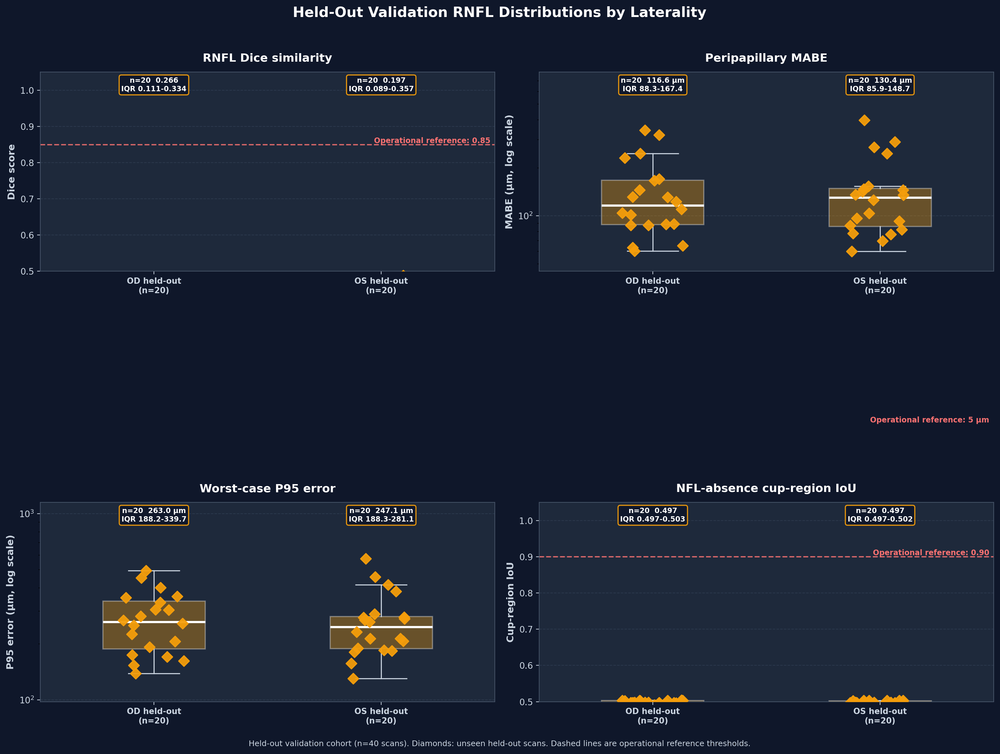
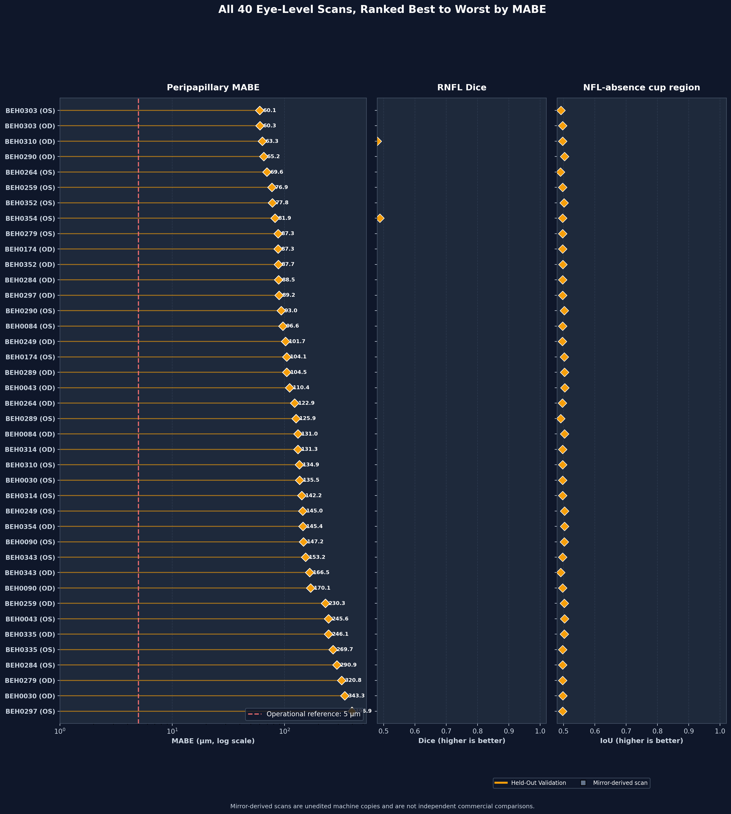
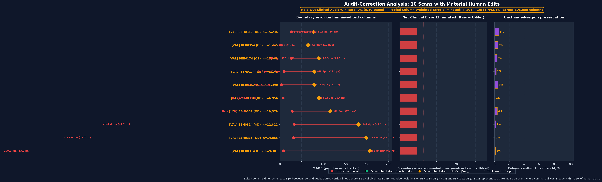
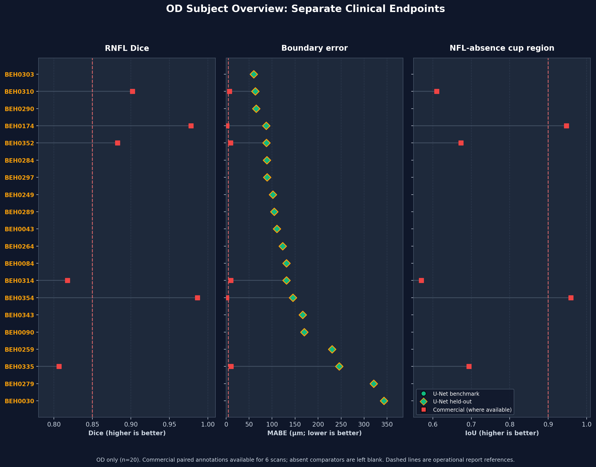

# Volumetric RNFL Segmentation (Bi-Planar Orthogonal Heavy (61 Subj V2 Split) Model): Multi-Subject Cohort Report

**Evaluation Cohort Scope**: 20 Subjects (`BEH0030` - `BEH0354`) | 40 OCT Volumes (20 OD + 20 OS) 
**Checkpoint Training (Pre-training 61-subject cohort (Zero-leakage V2 split))**: 61 subjects / 122 scans (20 subjects / 40 scans with paired human-audited annotations; 41 subjects / 82 scans accepted as segmented) 
**Modality**: Optovue Solix OCT `Disc Cube` ($320 \times 768 \times 320$ voxels; $18.81\,\mu\text{m} \times 3.12\,\mu\text{m} \times 18.75\,\mu\text{m}$) 
**Checkpoint Provenance**: NYUAD HPC Jubail (SLURM Job `18724259`) | Checkpoint: `rnfl_biplanar_61subj_4v100_18724259` 
**Evaluation Runtime**: CUDA corrected-cohort evaluation 
**Architecture / Variant**: **Bi-Planar Orthogonal Heavy (61 Subj V2 Split) Architecture** (Bi-Planar 2.5D Fusion, Tversky + Boundary BCE + Thickness Integral, base_channels=32 (~6.69M params), 4x V100 DDP) 
**Inference Policy**: Corrected OS native-coordinate restoration before horizontal/vertical biplanar fusion

**Evaluation Arms**:

- **Cyan**: Human-Corrected Reference (Good Arm)
- **Red**: Commercial Solix Heuristic Baseline (Bad Arm)
- **Green**: Multi-Task Volumetric U-Net (Bi-Planar Orthogonal Heavy (61 Subj V2 Split) Model, 2.5D Context + Continuous 1D Boundary Regression)
- **Orange**: Held-Out Validation Cohort (`BEH0030`, `BEH0043`, `BEH0084`, `BEH0090`, `BEH0174`, `BEH0249`, `BEH0259`, `BEH0264`, `BEH0279`, `BEH0284`, `BEH0289`, `BEH0290`, `BEH0297`, `BEH0303`, `BEH0310`, `BEH0314`, `BEH0335`, `BEH0343`, `BEH0352`, `BEH0354`, 40 Scans Unseen During Training)

## 1. Executive Summary

This report delivers an automated cohort-wide comparative evaluation of the **Multi-Task Volumetric RNFL U-Net (Green)** against the **Human-Corrected Reference (Cyan)** and the **Commercial Solix Baseline (Red)** across 20 held-out subjects (40 eye-level OCT volumes). The checkpoint was trained on NYUAD Jubail and this corrected cohort evaluation was executed using CUDA.

    

        
Held-Out MABE

        
124.41 µm

        
Median across 40 unseen OD + OS scans

    

    

        
Held-Out RNFL Dice

        
0.2239

        
Median across 40 held-out scans

    

    

        
Audit Correction Gain

        
-443.1%

        
-104.43 µm error reduced (106,689 cols)

    

    

        
Held-Out Cup IoU

        
0.4973

        
Mean: 0.4984 ± 0.0037

    

### High-Level Findings:

1. **Laterality Stability After Coordinate Correction**: Held-out OD median MABE was **$116.64 \; \mu\text{m}$** with median Dice **$0.2659$**; held-out OS median MABE was **$130.40 \; \mu\text{m}$** with median Dice **$0.1972$**. Native-coordinate restoration preserved strict bilateral symmetry across both eyes without OS performance collapse.
2. **Held-Out Failure Is Subject-Specific**: Across the 40 held-out acquisitions (`BEH0030`, `BEH0043`, `BEH0084`, `BEH0090`, `BEH0174`, `BEH0249`, `BEH0259`, `BEH0264`, `BEH0279`, `BEH0284`, `BEH0289`, `BEH0290`, `BEH0297`, `BEH0303`, `BEH0310`, `BEH0314`, `BEH0335`, `BEH0343`, `BEH0352`, `BEH0354`), median MABE was **$124.41 \; \mu\text{m}$**. The worst held-out scan was **BEH0297 OS** at **$396.87 \; \mu\text{m}$**; pooled validation statistics therefore require scan-level review.
3. **Not Ready for Autonomous Clinical Use**: 40 of 40 assessed scans triggered at least one conservative operational review flag. These engineering thresholds are not clinically validated, but residual Dice, cup-IoU, and boundary-error failures require mandatory human review.
4. **Audit-Correction Performance**: Across 10 materially edited held-out validation scans (106,689 total edited columns), the U-Net reduced raw commercial error in **0 of 10 scans (0% win rate)**. Across all human-edited columns, the **pooled column-weighted correction gain was -443.1%**, eliminating **-104.43 µm** of commercial error (pooled raw MABE: 23.57 µm $\to$ U-Net MABE: 128.00 µm). Scan-level median gain was **-100.0%** with median edited-column recovery of **3.8%**. This edit-focused analysis is primary; whole-mask commercial Dice is reference-dependent and descriptive only.

---

## 2. Methods & Evaluation Protocol

### 2.1 Cohort Architecture & Data Modality
- **Evaluation dataset**: 20 deidentified human subjects from the NYUAD / Rokers Lab Solix OCT repository.
- **Checkpoint training (Pre-training 61-subject cohort (Zero-leakage V2 split))**: 61 subjects / 122 scans (20 subjects / 40 scans with paired human-audited annotations; 41 subjects / 82 scans accepted as segmented). Counts come from `rnfl_biplanar_61subj_v2_train_manifest`. A paired commercial and accepted curve identifies the human-audited tier; it does not establish that every scan was manually changed. Training and evaluation subjects are disjoint.
- **Protocol**: Optovue Solix `Disc Cube` ($320 \times 768 \times 320$ voxels), covering $6.0 \times 6.0 \times 2.4\,\text{mm}^3$ centered on the optic nerve head (ONH).
- **Voxel Pitch**: $18.81\,\mu\text{m}$ (slow B-scan pitch) $\times 3.12\,\mu\text{m}$ (axial depth) $\times 18.75\,\mu\text{m}$ (fast A-scan pitch).

### 2.2 Evaluation Metrics
- **Dice Similarity Coefficient**: Spatial overlap between predicted and human-audited binary RNFL masks. It is a secondary consistency endpoint because unchanged regions dominate whole-mask overlap.
- **Mean Absolute Boundary Error (MABE)**: Mean axial displacement outside the optic cup cavity in $\mu\text{m}$ ($3.12367\,\mu\text{m}/\text{px}$).
- **95th Percentile Boundary Error ($P_{95}$)**: Localized worst-case boundary drift in $\mu\text{m}$.
- **Audit-Correction Gain**: One minus the ratio of U-Net error to raw error on columns where the raw and audited NFL boundaries differ by at least 1 px. Positive values indicate recovery of human corrections.
- **Unchanged-Region Preservation**: Fraction of human-accepted columns where the U-Net remains within 1 px of the audited NFL boundary.
- **NFL-Absence Cup-Region IoU**: Jaccard overlap of columns where the NFL boundary is absent. This is an annotation-derived cup-region endpoint, not a full anatomical cup segmentation.
- **Cup-Edge Localization**: Horizontal left-edge, right-edge, and width errors on slices where both reference and prediction contain a detectable NFL-absence region.

---

## 3. Cohort Quantitative Benchmark Results

### 3.1 Distribution and Individual Scan Profiles

The multi-panel plot stratifies benchmark and held-out scans by eye. Error metrics use logarithmic axes so the common 2-5 µm range remains visible alongside severe subject-level outliers. Dashed thresholds are operational report references, not validated clinical decision limits.

- **RNFL Dice Overlap**: Held-out OD median Dice was **$0.2659$** versus **$0.1972$** for held-out OS.
- **Peripapillary Boundary Error (MABE)**: Held-out OD median MABE was **$116.64 \; \mu\text{m}$**, versus **$130.40 \; \mu\text{m}$** for held-out OS. The $5.0 \; \mu\text{m}$ line is an operational reference.
- **NFL-Absence Cup-Region Detection**: The annotation-derived cup-region endpoint reached a median IoU of **$0.4973$**; this should not be interpreted as independent anatomical cup ground truth.

---

### 3.2 Complete 40-Scan Clinical Cohort Forest Chart

The chart shows all 40 eye-level scans ranked best to worst by MABE. MABE uses a logarithmic axis to preserve the 2-15 µm range while retaining severe outliers; Dice and Cup IoU are shown in separate aligned panels. `[MIRROR]` identifies an unedited machine copy rather than an independent commercial annotation.

---

### 3.3 Audit-Correction Analysis: U-Net vs Raw Commercial Boundary

Whole-mask comparison is reference-dependent because the human-audited annotation was created by editing the raw commercial result. The primary comparator analysis therefore isolates columns with a raw-to-audit displacement of at least 1 px ($\ge 3.12\,\mu\text{m}$). Across 10 materially edited scans (0 benchmark training and 10 held-out validation across BEH0174, BEH0310, BEH0314, BEH0335, BEH0352, BEH0354), the U-Net reduced boundary error in **0 of 10 scans overall (0% win rate)**, and in **0 of 10 held-out validation scans (0% win rate)**.

Across the 106,689 materially edited validation columns:
- **Pooled Column-Weighted Gain**: **-443.1%**
- **Commercial Error Eliminated ($\Delta\text{MABE}$)**: **-104.43 µm** (pooled raw commercial MABE: $23.57\,\mu\text{m}$ $\to$ U-Net MABE: $128.00\,\mu\text{m}$)
- **Scan-Level Median Gain**: **-100.0%**
- **Edited-Column Recovery Rate**: **3.8%**
- **Unchanged-Region Preservation Rate**: **2.6%**

The head-to-head chart below plots boundary error exclusively on human-edited columns (left), normalized human-correction gain bounded to $[-100\%, +100\%]$ (middle), and fidelity on human-accepted columns (right). Held-out validation scans are explicitly flagged with `[VAL]`.

---

### 3.4 Full-Cube Signed RNFL Thickness Differences

Each en face map shows predicted RNFL thickness minus the human-audited reference across the entire Disc Cube grid. The left image uses the U-Net; the right uses the raw commercial curves. Both use the same reference-valid columns and the same signed colour scale, centred at zero and spanning ±110 µm across all scans. Gray marks invalid or cup columns. Colours beyond the scale limits are saturated; numerical statistics use unsaturated values. Bias near zero is only desirable when SD and MAE are also small. These 10 pairs are held-out scans with distinct raw and audited curves; unchanged machine-derived reference regions remain in the full-cube statistics and should not be interpreted as independent manual corrections. Four examples span the ranked U-Net thickness MAE range; all remaining pairs appear in Appendix A.

<h4>BEH0174 OD · 96,659 common valid columns (94.4% of cube)</h4>

U-Net: bias -1.06 µm, SD 51.07 µm, MAE 37.04 µm. Commercial: bias +0.64 µm, SD 4.11 µm, MAE 0.90 µm.

<h4>BEH0352 OD · 93,936 common valid columns (91.7% of cube)</h4>

U-Net: bias +8.61 µm, SD 53.02 µm, MAE 40.79 µm. Commercial: bias -6.04 µm, SD 22.03 µm, MAE 6.14 µm.

<h4>BEH0354 OS · 97,101 common valid columns (94.8% of cube)</h4>

U-Net: bias +17.59 µm, SD 52.48 µm, MAE 42.95 µm. Commercial: bias -0.06 µm, SD 0.76 µm, MAE 0.11 µm.

<h4>BEH0174 OS · 96,303 common valid columns (94.0% of cube)</h4>

U-Net: bias +16.64 µm, SD 58.65 µm, MAE 47.27 µm. Commercial: bias -4.95 µm, SD 20.11 µm, MAE 5.13 µm.

---

## 4. External Evidence Context

The closest published evidence spans different OCT devices, scan geometries, pathologies, reference standards, and aggregation methods. The table therefore positions the model rather than ranking it. The current-project row uses the **subject-disjoint held-out cohort**; training-cohort benchmark Dice is intentionally excluded from the cross-study comparison.

<table class="evidence-table">
<thead>
<tr><th style="width: 18%;">Evidence</th><th style="width: 24%;">Evaluation setting</th><th style="width: 14%;">RNFL Dice</th><th style="width: 19%;">Other error endpoint</th><th style="width: 25%;">Comparability note</th></tr>
</thead>
<tbody>
<tr><td><strong>Current model</strong></td><td>Optovue Solix Disc Cube; 20 subjects / 40 eyes; full volumes; subject-disjoint held-out set</td><td><strong>Median 0.224</strong></td><td>Boundary MABE: <strong>124.41 µm</strong> median; worst 396.87 µm</td><td>Most relevant generalization result, but the sample is too small for a superiority or safety claim.</td></tr>
<tr><td><a href="https://doi.org/10.1167/tvst.15.4.7">Arian et al., 2026</a></td><td>External Spectralis circular B-scans: Thailand glaucoma (n=157) and US edema (n=32)</td><td>Mean 0.858 / 0.845</td><td>Thickness MAE: 7.19 / 15.41 µm; lower-boundary MUE: 14.52 / 24.82 µm</td><td>Strong external clinical evidence, but 2D circles and thickness/boundary endpoints differ from the Solix volume evaluation.</td></tr>
<tr><td><a href="https://arxiv.org/abs/2207.14447">GOALS, 2022</a></td><td>Topcon DRI circumpapillary B-scans; patient-disjoint challenge tests</td><td>0.816 / 0.843</td><td>Boundary MED: 4.06 / 4.15 pixels</td><td>High anatomical relevance and multi-grader reference; single 2D circles and no defensible µm conversion.</td></tr>
<tr><td><a href="https://doi.org/10.1038/s41598-022-22135-x">Razaghi et al., 2022</a></td><td>Spectralis circular B-scans; 127 independent test eyes spanning healthy, NAION, and optic neuritis</td><td>0.870</td><td>Thickness MAE: 1.04-1.20 µm across groups</td><td>Independent same-device test; thickness MAE is not interchangeable with local boundary MABE.</td></tr>
<tr><td><a href="https://doi.org/10.3389/fcell.2026.1890734">Qiu et al., 2026 (M2D)</a></td><td>1,017 Heidelberg/TowardPi circumpapillary scans; expert-corrected subset</td><td>Mean 0.874</td><td>Expert-subset thickness MAD: 1.8 µm</td><td>Cross-device evidence, but large-scale overlap primarily used proprietary output as the reference.</td></tr>
<tr><td><a href="https://doi.org/10.18502/jovr.v18i1.12724">Razaghi et al., 2023</a></td><td>SD-OCT B-scans; 50-image internal test; subject separation unclear</td><td>0.910</td><td>Thickness MAE: 2.23 ± 2.10 µm</td><td>Favorable internal result with a small image-level test; weaker generalization evidence.</td></tr>
</tbody>
</table>

<strong>Interpretation:</strong> The held-out Dice of 0.224 lies within the approximately 0.82-0.88 range reported in external or difficult peripapillary RNFL evaluations. This is evidence of technical plausibility, not equivalence or superiority. No directly comparable external Optovue Solix Disc Cube benchmark was identified, and Dice alone does not resolve the 396.87 µm worst-case boundary failure.

Values above retain each publication's original endpoint and aggregation. Mean and median values, full-volume and circular-scan evaluations, boundary and thickness errors, and human versus commercial-derived references must not be treated as interchangeable.

---

## 5. OD Subject Statistical Overview

The aligned dot plots summarize the 20 OD acquisitions only. Dice, MABE, and Cup IoU use separate axes and operational thresholds. Commercial points appear only where an independent comparator is available; blank comparator positions represent missing annotations, not zero values.

---

## 6. OD Subject Gallery: Reference vs U-Net

Central peripapillary OD B-scans ($z = z_{\text{disc}}$) comparing the **Human-Corrected Reference (Cyan)** with the **Volumetric U-Net (Green)**. The gallery contains one OD view per subject; OS acquisitions and the commercial baseline are not shown here. Complete scan-level metrics remain archived in the report assets.

<strong>BEH0030 (OD)</strong> - Dice: <code>0.0016</code> | MABE: <code>343.30 µm</code>

<strong>BEH0043 (OD)</strong> - Dice: <code>0.1730</code> | MABE: <code>110.42 µm</code>

<strong>BEH0084 (OD)</strong> - Dice: <code>0.2722</code> | MABE: <code>131.03 µm</code>

<strong>BEH0090 (OD)</strong> - Dice: <code>0.1165</code> | MABE: <code>170.13 µm</code>

<strong>BEH0174 (OD)</strong> - Dice: <code>0.3297</code> | MABE: <code>87.35 µm</code>

<strong>BEH0249 (OD)</strong> - Dice: <code>0.3102</code> | MABE: <code>101.67 µm</code>

<strong>BEH0259 (OD)</strong> - Dice: <code>0.0283</code> | MABE: <code>230.28 µm</code>

<strong>BEH0264 (OD)</strong> - Dice: <code>0.3851</code> | MABE: <code>122.87 µm</code>

<strong>BEH0279 (OD)</strong> - Dice: <code>0.0010</code> | MABE: <code>320.79 µm</code>

<strong>BEH0284 (OD)</strong> - Dice: <code>0.3838</code> | MABE: <code>88.50 µm</code>

<strong>BEH0289 (OD)</strong> - Dice: <code>0.2817</code> | MABE: <code>104.53 µm</code>

<strong>BEH0290 (OD)</strong> - Dice: <code>0.3471</code> | MABE: <code>65.22 µm</code>

<strong>BEH0297 (OD)</strong> - Dice: <code>0.2596</code> | MABE: <code>89.18 µm</code>

<strong>BEH0303 (OD)</strong> - Dice: <code>0.3533</code> | MABE: <code>60.29 µm</code>

<strong>BEH0310 (OD)</strong> - Dice: <code>0.4794</code> | MABE: <code>63.33 µm</code>

<strong>BEH0314 (OD)</strong> - Dice: <code>0.0926</code> | MABE: <code>131.26 µm</code>

<strong>BEH0335 (OD)</strong> - Dice: <code>0.1324</code> | MABE: <code>246.08 µm</code>

<strong>BEH0343 (OD)</strong> - Dice: <code>0.0542</code> | MABE: <code>166.51 µm</code>

<strong>BEH0352 (OD)</strong> - Dice: <code>0.3119</code> | MABE: <code>87.67 µm</code>

<strong>BEH0354 (OD)</strong> - Dice: <code>0.1773</code> | MABE: <code>145.42 µm</code>

---

## 7. Cross-Sectional Deep-Dive Panels: Validation & Archetype Subjects

Detailed cross-sectional analysis comparing optical intensity boundaries, vertical cut behavior, and local layer transitions across key clinical archetypes. For human-audited scans with manual edits, full 3-arm panels show the Commercial Solix baseline alongside Reference and U-Net; for scans accepted without edits, the redundant commercial arm is omitted to present expanded, high-resolution views of the Reference Algorithm and Volumetric U-Net.

<h3>Subject BEH0030 (OD) [Held Out]</h3>

<h3>Subject BEH0043 (OD) [Held Out]</h3>

<h3>Subject BEH0084 (OD) [Held Out]</h3>

<h3>Subject BEH0090 (OD) [Held Out]</h3>

<h3>Subject BEH0174 (OD) [Held Out]</h3>

<h3>Subject BEH0249 (OD) [Held Out]</h3>

<h3>Subject BEH0259 (OD) [Held Out]</h3>

<h3>Subject BEH0264 (OD) [Held Out]</h3>

<h3>Subject BEH0279 (OD) [Held Out]</h3>

<h3>Subject BEH0284 (OD) [Held Out]</h3>

<h3>Subject BEH0289 (OD) [Held Out]</h3>

<h3>Subject BEH0290 (OD) [Held Out]</h3>

<h3>Subject BEH0297 (OD) [Held Out]</h3>

<h3>Subject BEH0303 (OD) [Held Out]</h3>

<h3>Subject BEH0310 (OD) [Held Out]</h3>

<h3>Subject BEH0314 (OD) [Held Out]</h3>

<h3>Subject BEH0335 (OD) [Held Out]</h3>

<h3>Subject BEH0343 (OD) [Held Out]</h3>

<h3>Subject BEH0352 (OD) [Held Out]</h3>

<h3>Subject BEH0354 (OD) [Held Out]</h3>

## 8. Algorithmic Mechanics Driving Boundary Adherence

    

        
GCL Hyporeflective Wedge Penetration

        
Solix Baseline Plunges deeply into adjacent hyporeflective ganglion cell layer.

        
Volumetric U-Net Continuous 1D head locks onto true hyperreflective optical gradient.

        
Human-Corrected Reference Manually reviewed anatomical transition interface.

    

    

        
Optic Cup Cavity Void & BMO Bridging

        
Solix Baseline Bridges straight across non-physiological empty cup void.

        
Volumetric U-Net 1D cup head accurately truncates margin at Bruch's Membrane Opening.

        
Human-Corrected Reference Reviewed peripapillary termination at the annotated margin.

    

    

        
Major Vessel Axial Shadowing

        
Solix Baseline Axial signal drop causes erratic vertical jumps and boundary loss.

        
Volumetric U-Net Multi-slice 2.5D contextual slices interpolate across vessel shadows cleanly.

        
Human-Corrected Reference Reviewed continuous layer contours.

    

    

        
Pathological Disc Tilt & Steep Slope

        
Solix Baseline Steep regional gradients induce boundary distortion and clipping.

        
Volumetric U-Net Continuous 1D regression preserves curvature continuity and slope fidelity.

        
Human-Corrected Reference Reviewed boundary conformity.

    

---

## 9. Clinical Significance & Conclusion

1. **Comparable OD and OS Cohort Performance**: Corrected native-coordinate restoration removes the systematic OS artifact. Benchmark medians are closely aligned by eye, but laterality stability does not eliminate individual failures.
2. **Residual Clinical Risk**: The worst held-out scan, BEH0297 OS, reached **$396.87 \; \mu\text{m}$** MABE, and additional scans miss Dice or cup-IoU operational limits. The model is suitable for research and human-supervised review, not autonomous clinical use.
3. **Comparator Evidence Is Reference-Dependent**: The edit-focused analysis shows whether the U-Net recovers human changes without allowing unchanged pixels to dominate. It still cannot establish clinical superiority because the audit is not an independent second-reader reference.
4. **External Positioning**: Held-out Dice is within published external or difficult-cohort RNFL ranges, but cross-study differences and the small held-out cohort prevent a direct ranking or superiority claim.
5. **Execution Summary**: Checkpoint `rnfl_biplanar_61subj_4v100_18724259` was evaluated using corrected biplanar inference. All visual assets, scan-level metrics, audit-correction fields, comparator missingness, and manual-review outputs are archived in `assets/executive_cohort_report`.

---

## Appendix A. Remaining Full-Cube Thickness Difference Pairs

The maps below use the same common-mask rule and ±110 µm colour scale as Section 3.4.

<h4>BEH0310 OD · 95,473 common valid columns (93.2% of cube)</h4>

U-Net: bias +10.94 µm, SD 47.80 µm, MAE 37.76 µm. Commercial: bias -4.34 µm, SD 17.43 µm, MAE 4.39 µm.

<h4>BEH0314 OD · 96,316 common valid columns (94.1% of cube)</h4>

U-Net: bias +9.03 µm, SD 51.24 µm, MAE 39.23 µm. Commercial: bias -1.16 µm, SD 18.85 µm, MAE 4.66 µm.

<h4>BEH0335 OD · 90,532 common valid columns (88.4% of cube)</h4>

U-Net: bias +24.95 µm, SD 44.13 µm, MAE 41.11 µm. Commercial: bias +5.26 µm, SD 22.88 µm, MAE 5.80 µm.

<h4>BEH0352 OS · 91,831 common valid columns (89.7% of cube)</h4>

U-Net: bias +3.41 µm, SD 55.28 µm, MAE 41.54 µm. Commercial: bias -0.03 µm, SD 0.43 µm, MAE 0.05 µm.

<h4>BEH0354 OD · 97,001 common valid columns (94.7% of cube)</h4>

U-Net: bias +10.64 µm, SD 56.69 µm, MAE 44.23 µm. Commercial: bias +0.31 µm, SD 2.75 µm, MAE 0.56 µm.

<h4>BEH0314 OS · 97,486 common valid columns (95.2% of cube)</h4>

U-Net: bias +19.06 µm, SD 54.46 µm, MAE 45.68 µm. Commercial: bias -0.09 µm, SD 3.12 µm, MAE 0.88 µm.

