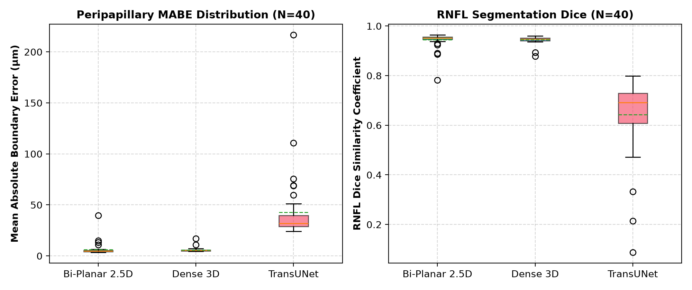
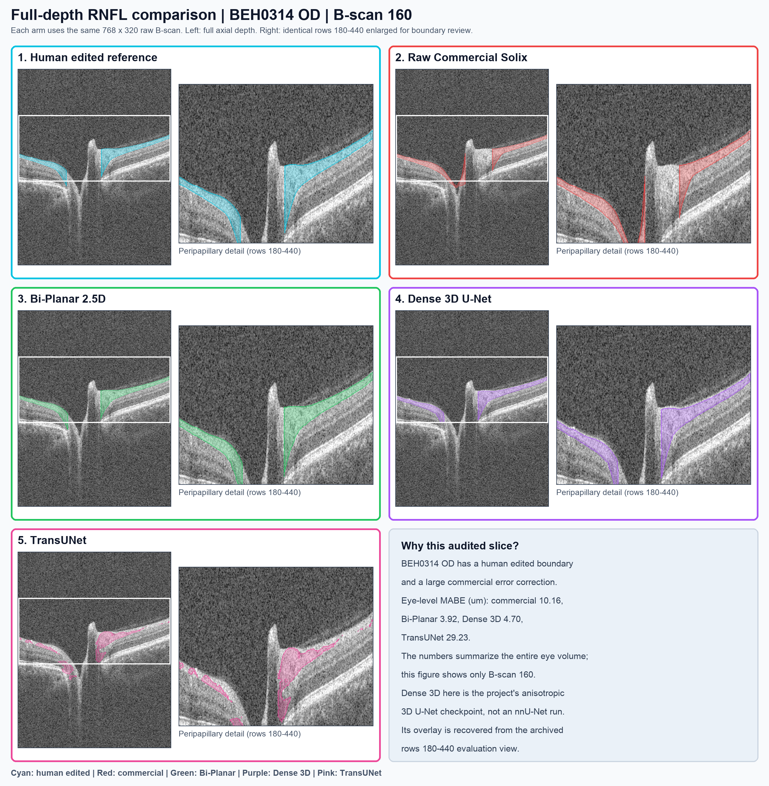

# Three-Architecture RNFL Benchmark: Bi-Planar 2.5D, Dense 3D, and TransUNet

**Protocol:** Optovue Solix peripapillary RNFL volumetric segmentation  
**Validation set:** `stratified_held_out_v2.json`; 20 subjects, 40 paired OD/OS volumes unseen during training  
**Checkpoints:** Bi-Planar job `18563914`; Dense 3D job `18574378`; TransUNet job `18710145`  
**Evaluation:** Corrected native OS orientation, biplanar fusion where configured, and cup-reach boundary tracking  
**Report date:** 8 October 2026

## Executive finding

Bi-Planar has the lowest median boundary error (4.71 µm), the best mean cup IoU (0.9388), and lower MABE than Dense 3D on 34/40 held-out eyes. Dense 3D has the lower **mean** MABE (5.87 versus 6.22 µm) and the lower **observed maximum** (17.02 versus 39.64 µm). TransUNet is substantially worse on this benchmark despite using horizontal/vertical biplanar inference. These results support Bi-Planar as the lead *research* candidate and Dense 3D as a candidate for disagreement-based quality control; neither role has been prospectively validated for clinical deployment.

## 1. Held-out cohort (40 eyes for each model)

| Metric | Bi-Planar 2.5D | Dense 3D U-Net | TransUNet |
| :--- | ---: | ---: | ---: |
| Parameters | ~6.58M | ~20.90M | ~3.76M |
| Median RNFL Dice | **0.9518** | 0.9471 | 0.6922 |
| Mean Dice ± sample SD | 0.9441 ± 0.0309 | **0.9446 ± 0.0152** | 0.6435 ± 0.1480 |
| Median MABE | **4.71 µm** | 5.50 µm | 31.90 µm |
| Mean MABE ± sample SD | 6.22 ± 5.91 µm | **5.87 ± 2.13 µm** | 42.69 ± 33.00 µm |
| Median P95 boundary error | **16.85 µm** | 18.93 µm | 86.47 µm |
| Mean cup IoU ± sample SD | **0.9388 ± 0.0204** | 0.9085 ± 0.0464 | 0.7282 ± 0.0762 |
| Observed maximum scan MABE | 39.64 µm | **17.02 µm** | 216.55 µm |

All rows above use the same 40 validation eyes. The maximum is a sample observation, not a bound on future failures. Bi-Planar's mean is influenced by `BEH0290 OD` (39.64 µm); Dense 3D recorded 4.84 µm on that eye. Bi-Planar had lower MABE than TransUNet on 39/40 eyes. The earlier [paired 3D comparison](../3d_vs_biplanar_comparison/research_report_3d_vs_biplanar_comparison.md) provides the subject-level uncertainty and outlier sensitivity analysis for the Bi-Planar versus 3D comparison.

*Figure 1. Model distributions across 40 paired held-out eyes. The plots describe this cohort and do not estimate a population failure rate.*

## 2. Full-depth audited B-scan: five-arm comparison

The same **BEH0314 OD, B-scan 160** is shown in every arm. This eye is in the human-edited, held-out validation tier. Each upper view shows **all 768 axial rows and all 320 lateral columns** of the original Solix slice. The adjacent view enlarges the same rows 180-440 so thin RNFL boundaries remain inspectable at page scale. Colored regions and contours show the corresponding RNFL segmentations. The Dense 3D checkpoint is the project's anisotropic 3D U-Net, **not an nnU-Net implementation**.

*Figure 2. One aligned source slice, five segmentations: cyan human edited; red raw commercial; green Bi-Planar; purple Dense 3D; pink TransUNet. Bi-Planar and TransUNet masks were regenerated from the named local checkpoints using the benchmark's biplanar fusion and thresholds. The purple overlay was visually digitized from the archived 3D evaluation image, which shows only axial rows 180-440; the full-depth grayscale remains visible, but no 3D mask is asserted outside that window. This purple overlay is illustrative and is not used for measurements. BEH0314 OD was chosen because its commercial curve required substantial human correction; whole-eye MABE is 10.16 µm commercial, 3.92 µm Bi-Planar, 4.70 µm Dense 3D, and 29.23 µm TransUNet. These whole-eye metrics do not describe the single displayed slice.*

## 3. Expert-corrected tier (10 eyes from six subjects)

These eyes have both a commercial `bad` curve and an expert-corrected `good` curve. All model metrics below are scored against `good`. The commercial column is available **only for these 10 eyes**, so it must not be read as a 40-eye cohort result.

| Metric | Commercial `bad` | Bi-Planar 2.5D | Dense 3D U-Net | TransUNet |
| :--- | ---: | ---: | ---: | ---: |
| Mean RNFL Dice | 0.9233 | **0.9485** | 0.9441 | 0.6512 |
| Mean MABE | 5.17 µm | **5.13 µm** | 6.12 µm | 35.71 µm |
| Mean P95 boundary error | 34.21 µm | **18.12 µm** | 22.26 µm | 98.27 µm |
| Mean cup IoU | 0.8063 | **0.9407** | 0.8967 | 0.7632 |
| Eyes with lower MABE than commercial `bad` | Reference | 4/10 | 4/10 | 0/10 |

Bi-Planar had lower MABE than Dense 3D on **10/10** corrected eyes and lower MABE than TransUNet on **10/10**. Its mean MABE was only 0.04 µm below the commercial reference on this tier, and it improved MABE over that reference on 4/10 eyes. The earlier report's 8-eye denominator and large claimed commercial-error reduction were unsupported by these archived scan-level values. The corrected tier is small; eye-level observations from the same subject are correlated.

## 4. Interpretation of the TransUNet result

The TransUNet evaluation metadata records `biplanar_fusion: true`, and its [executive report](../2026-10-08_transunet_hybrid_18710145/executive_cohort_rnfl_report_transunet_v100_job_18710145_20261008_101441.md) specifies horizontal/vertical inference. Lack of an orthogonal view therefore cannot explain this result. Its lower Dice and higher boundary errors establish underperformance of the **evaluated checkpoint and pipeline**, not a general limitation of attention-based models.

Axial downsampling, decoder skip connections, optimization, and the boundary loss are plausible mechanisms to investigate. Isolating any one cause requires an ablation with the same subjects, training budget, loss, inference procedure, and postprocessing. Anisotropic tokenization or stronger high-resolution skips are research proposals, not findings of this comparison.

## 5. Model-selection implication

Use Bi-Planar as the lead research checkpoint for the next validation stage. Investigate whether disagreement with Dense 3D identifies the Bi-Planar outlier without producing excessive false alarms. Keep TransUNet as an experimental architecture pending controlled ablations. No model here has enough external or prospective evidence to claim standalone clinical readiness.

## 6. Evidence and calculation notes

- Split: `train-cnn-models/model_training/train_rnfl_3d/manifests/stratified_held_out_v2.json`.
- Scan-level source files: [Bi-Planar](../2026-10-03_biplanar_expanded_18563914/assets/executive_cohort_report/cohort_evaluation_metrics.json), [Dense 3D](../2026-10-04_rnfl_3d_expanded_18574378/assets/executive_cohort_report/cohort_evaluation_metrics.json), and [TransUNet](../2026-10-08_transunet_hybrid_18710145/assets/executive_cohort_report/cohort_evaluation_metrics.json).
- Filter: `is_validation == true`; pair scans by `(subject, eye)`. Corrected tier: `audit_edited_columns > 0` in all three files. Means, medians, sample SDs, and observed maxima use finite scan-level values. The commercial `bad` metrics are reported only for the 10 corrected eyes, using the Dense 3D evaluation file's complete commercial fields.
- Model wins use strictly lower per-eye `unet_mabe`; ties would not count as wins. No commercial maximum for the 40-eye cohort is reported because commercial `bad_mabe` is absent outside the corrected tier.
- Figure 2 source: `deidentified-new` DICOM and paired `tsv/good`/`tsv/bad` XML for BEH0314 OD. Reproduction code and central-slice masks are in this report directory. The DICOM and XML were selectively hydrated from Box Drive for generation and then evicted; no raw volume is stored with the report.
