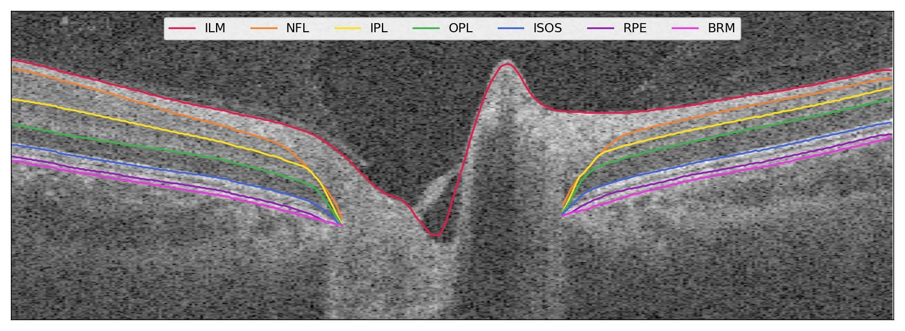
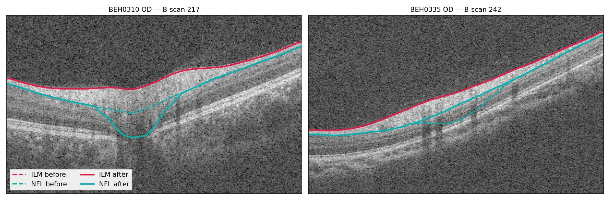

# OCT Layer Segmentation: Validation, Correction, Release

**Locating the segmentation labels, verifying manual corrections reach the export, and releasing a de-identified dataset for the segmentation capstone.**

---

## 1. Executive Summary & Overview

This document formalizes the technical investigation, label extraction pipeline, algorithmic validation, and clinician ground-truth verification for the **Optovue Solix OCT** dataset (205 participants, NYU Abu Dhabi / Rokers Lab cohort). 

### Key Discoveries:
1. **DICOM Segmentation Void**: The standard Solix DICOM export declares `Segmentation` and `SurfaceSegmentation` objects for eight retinal boundaries, but every single object is completely empty ($0$ bytes of valid surface points, yielding 1.4 GB per participant of all-zero data).
2. **Curve XML Discovery**: True boundary contours are located exclusively in external XML curve files (`data/tsv/<ID>/curve/`, 2,048 files across all participants and acquisition protocols).
3. **1:1 Native Coordinate Mapping**: XML curve indices map directly to DICOM frame, column, and row coordinates without requiring spatial resampling or interpolative warping.
4. **Sub-Micron Reproduction of Machine Metrics**: Computing layer thickness directly from XML curves reproduces the manufacturer's own device measurements with sub-micron mean differences ($\le 0.37\,\mu\text{m}$ for retina/GCC, $< 0.8\,\mu\text{m}$ for peripapillary RNFL).
5. **Propagation of Clinician Corrections**: Manually redrawing the optic disc margin on the Solix console successfully reaches the re-exported curve XML labels, shifting the RNFL posterior boundary to restore anatomically valid boundaries.
6. **Rectification of Severe Heuristic Failures**: Original manufacturer automated disc segmentations were not just slightly off—they produced physically impossible values (e.g. negative neuroretinal rim area $-0.08\,\text{mm}^2$, cup-to-disc ratio pinned at $1.000$, and implausible $371.9\,\mu\text{m}$ RNFL thickness). Clinician corrections restored all eyes into the normal physiological disc area range ($1.5$–$2.5\,\text{mm}^2$).

---

## 2. The Segmentation Labels Are Not in the DICOM

The Solix DICOM export contains `Segmentation` and `SurfaceSegmentation` objects that declare eight retinal boundaries. **Every single one of them is empty.**

| Metric / Dimension | Specification | Detail / Impact |
| :--- | :--- | :--- |
| **Actual Segmentation in DICOM** | **0 bytes** | 1.4 GB per participant of all-zero volumes, plus surface objects with no point data |
| **Real Label Storage** | **2,048 XML files** | `data/tsv/<ID>/curve/` — one file per protocol per eye, all 205 participants |
| **Coordinate Alignment** | **1:1 Index Mapping** | Curve index maps directly onto DICOM frame, column, and row (no resampling required) |

> [!WARNING]
> **Consequence for Capstone Ingestion Pipeline**:  
> Any pipeline or model training workflow built on the DICOM segmentation objects would have silently produced empty masks or failed without error messages. The external XML curves are the **only** valid source of true retinal layer boundaries in the Solix platform export.

---

## 3. Exported Boundaries Align with the Images

The seven exported retinal boundaries from the XML map directly onto the OCT volume B-scans with zero shift, zero vertical/horizontal flip, and zero rescaling.

### Boundary Definitions & Layers (Color Coding)
- ILM: Inner Limiting Membrane (Vitreo-retinal interface)
- NFL: Retinal Nerve Fiber Layer posterior boundary
- IPL: Inner Plexiform Layer boundary
- OPL: Outer Plexiform Layer boundary
- ISOS: Inner Segment / Outer Segment junction (Photoreceptor inner/outer segment line)
- RPE: Retinal Pigment Epithelium
- BRM: Bruch's Membrane

> [!NOTE]
> **Optic Cup Rim Termination**:  
> As seen in the cross-section, boundaries terminate cleanly at the **optic cup rim / Bruch's Membrane Opening (BMO)**, precisely where the outer retinal layers anatomically terminate and do not physically exist.

---

## 4. Algorithmic Reproducibility: Matching Machine Measurements

Layer thicknesses derived from the raw XML curve coordinates faithfully reproduce the Solix machine's own internal clinical measurement printouts.

### Thickness Calculation Formula
$$\text{Thickness} = (\text{outer boundary row} - \text{inner boundary row}) \times 3.124\,\mu\text{m}$$

Averaged over the standard **ETDRS grid** centered on the fovea, computed for every eye in the release and compared against the Solix device's own reported clinical values:

| Clinical Measure | Eyes Evaluated ($N$) | Mean Difference | Worst Single Eye |
| :--- | :---: | :---: | :---: |
| **Retinal thickness, central 1 mm** | 22 | **$0.37\,\mu\text{m}$** | $1.40\,\mu\text{m}$ |
| **Retinal thickness, full 0–6 mm grid** | 22 | **$0.17\,\mu\text{m}$** | $0.35\,\mu\text{m}$ |
| **GCC thickness, 0–6 mm** | 22 | **$0.22\,\mu\text{m}$** | $0.60\,\mu\text{m}$ |
| **Disc area** | 21 | **$0.028\,\text{mm}^2$** | $0.053\,\text{mm}^2$ |
| **RNFL, 3.45 mm circumpapillary circle** | 21 | **$0.79\,\mu\text{m}$** | $2.83\,\mu\text{m}$ |

All differences are within sub-pixel rounding error ($\Delta z_{\text{axial}} = 3.124\,\mu\text{m}$/voxel), confirming mathematical parity between XML curve coordinates and machine diagnostic output.

---

## 5. Manual Corrections Reach the Re-Exported Labels

A critical question for supervised model training is whether clinician manual edits on the acquisition device update the exported curve files or are discarded by the manufacturer's export module.

Comparative B-scans before and after manual disc margin correction:

*Comparison across two representative eyes:*
- **Left**: `BEH0310 OD` — B-scan 217
- **Right**: `BEH0335 OD` — B-scan 242

### Visual Trajectory Analysis:
- **Dashed lines (`--`)**: Original automated Solix segmentation.
- **Solid lines (`—`)**: Segmentations after redrawing the optic disc margin on the Solix console.
- **Result**: The **nerve-fiber boundary (NFL, cyan)** moves substantially at the optic disc, conforming accurately to true tissue architecture. The **inner limiting membrane (ILM, red)** remains stable and barely changes, exactly as expected clinically.

---

## 6. Baseline Solix Heuristic Failures & Clinician Correction

The original automated disc segmentations produced by the Solix commercial heuristics were not merely slightly inaccurate—in several eyes, they produced physically impossible or biologically implausible values prior to manual intervention.

### Cohort Pathology & Failure Cases

| Subject / Eye | Disc Area Before $\rightarrow$ After | What Was Wrong Originally (Heuristic Failure) |
| :--- | :---: | :--- |
| **`BEH0174 OS`** | $0.80 \rightarrow \mathbf{2.12\,\text{mm}^2}$ | **Rim area reported as negative** ($-0.08\,\text{mm}^2$) |
| **`BEH0310 OD`** | $0.64 \rightarrow \mathbf{2.41\,\text{mm}^2}$ | **Cup-to-disc ratio pinned at exactly $1.000$** |
| **`BEH0314 OD`** | $0.94 \rightarrow \mathbf{1.54\,\text{mm}^2}$ | **RNFL thickness reported as $371.9\,\mu\text{m}$** (normal $\approx 100\,\mu\text{m}$) |
| **`BEH0335 OD`** | $4.24 \rightarrow \mathbf{2.45\,\text{mm}^2}$ | **Rim area $3.90\,\text{mm}^2$**, disc implausibly enlarged |

### Clinical Outcome:
Following manual clinician correction:
- **Normal Range Restored**: All corrected disc area values fall cleanly within the normal physiological range of **$1.5$–$2.5\,\text{mm}^2$**.
- **Protocol Cross-Consistency**: The two separate disc scan protocols on the Solix agree with each other to within **$0.01\,\text{mm}^2$**.

---

## 7. Implications for Capstone Model Development

1. **Ingestion Standard**: The ingestion pipeline must parse `data/tsv/<ID>/curve/` XML files for ground truth labels instead of DICOM segmentation tags.
2. **Ground Truth Quality**: Training on raw uncorrected Solix outputs would induce catastrophic error modes (such as negative neuroretinal rim volume or pinned cup-to-disc ratios). The clinician-corrected dataset serves as the gold standard for model training and benchmark evaluations.
3. **Multi-Model Synergy**: This document provides the empirical justification for the clinician ground truth baseline evaluated in `docs/executive_cohort_rnfl_report.md` and `docs/unet_vs_algorithm_segmentation_report.md`.
