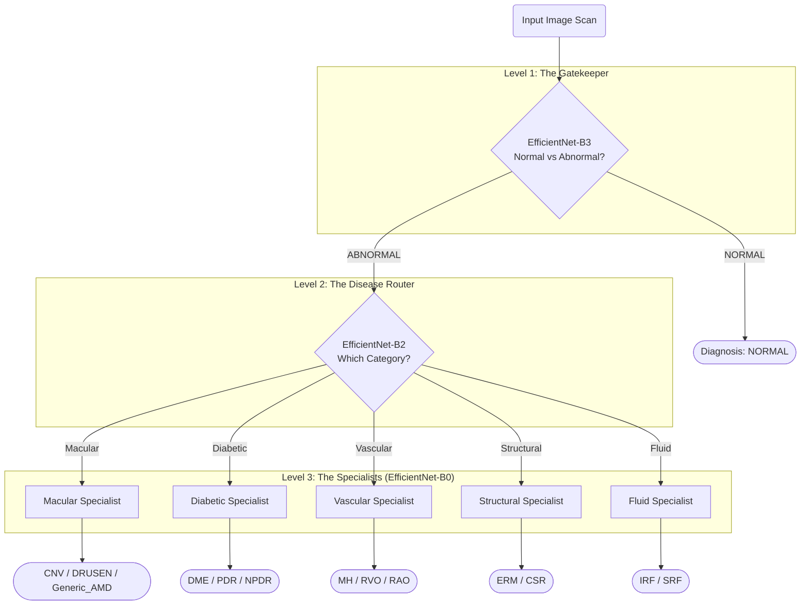

# Hierarchical OCT/OCTA Image Classification Architecture

> [!NOTE]
> **What exactly did we build?**
> We built a **Hierarchical Convolutional Neural Network (CNN) Ensemble**. 
> It is **NOT** a Recurrent Neural Network (RNN) or a Transformer (like ViT). We utilized **Transfer Learning**, taking state-of-the-art image recognition models (EfficientNet family) that were pre-trained on millions of real-world images, and specialized them specifically for medical OCT scan analysis.

Instead of training a single massive model to classify all possible diseases at once (which struggles with rare diseases and structural similarities), we built a **triage system** (a cascade/hierarchy of models). It mimics how a medical system works: a general practitioner (Gatekeeper) routes you to a department (Router), which then assigns you to a specialized expert (Specialist).

---

## 1. The Global Data Flow

Here is the visual representation of how a single input scan flows through our hierarchical pipeline during inference:



---

## 2. Layer-by-Layer Breakdown

### Level 1: The Gatekeeper (Binary Triage)
- **Model Backbone:** `EfficientNet-B3`
- **Role:** Safely screen out healthy patients. Optimized for maximum Recall, ensuring no sick patient is missed. EfficientNet-B3 achieves this with 3× fewer parameters than ResNet-50 (12.2M vs 25.6M) while reaching higher ImageNet Top-1 accuracy (82.2% vs 80.9%), translating to better feature extraction for subtle retinal pathology.
- **Input Resolution:** `224 x 224` pixels (Fast throughput).
- **Output Classes (2):** `NORMAL` vs `ABNORMAL`.
- **Parameters:** 12.2M (vs 25.6M for ResNet-50 — ~2× more efficient)
- **ImageNet Top-1:** 82.2% (vs 80.9% for ResNet-50)
- **Grad-CAM Target:** `model.features[-1]` — last MBConv block before global average pooling.

> [!TIP]
> **Why switch from ResNet-50 to EfficientNet-B3?**
> EfficientNet's compound scaling (depth × width × resolution) simultaneously captures fine-grained local texture AND broader structural context — both are crucial for detecting drusen deposits, fluid accumulation, and membrane changes in retinal OCT scans.

| Flow | Layer | Role in Architecture |
|:---:|---|---|
| 🟢 | **Input** | CLAHE-normalised scan (224×224×3) |
| ↓ | **Stem** | Initial Conv3×3 feature extraction |
| ↓ | **MBConv 1–2** | Low-level edge and texture detection |
| ↓ | **MBConv 3–5** | Compound-scaled mid-level pathology features |
| ↓ | **MBConv 6–7** | High-level semantic disease representations |
| ↓ | **GAP** | AdaptiveAvgPool2d → 1536-d feature vector |
| ↓ | **FC Head** | Dropout → Linear(1536,512) → ReLU → Linear(512,2) |
| 🏁 | **Output** | Binary triage: NORMAL vs ABNORMAL |

### Level 2: The Disease Router
- **Model Backbone:** `EfficientNet-B2`
- **Role:** Broad categorization. It looks at an abnormal scan and determines the general nature of the pathology. EfficientNet-B2 provides an excellent balance of depth and width to recognize broad structural differences.
- **Input Resolution:** `224 x 224` pixels.
- **Output Classes (5):** `Macular_Degeneration`, `Diabetic_Complications`, `Vascular_Occlusions`, `Structural_Issues`, `Fluid_Accumulation`.

| Flow | Layer | Role in Architecture |
|:---:|---|---|
| 🟢 | **Input** | Abnormal patient scan (224x224x3) |
| ↓ | **Stem** | Initial feature extraction (Conv3x3) |
| ↓ | **MBConv 1** | Mobile Inverted Bottleneck: Efficient spatial filtering |
| ↓ | **MBConv 2** | Includes Squeeze & Excitation: Attends to important feature channels |
| ↓ | **MBConv 3** | Scaled Width & Depth (EfficientNet-B2 scaling) for broader patterns |
| ↓ | **Head** | Conv1x1 & Pooling: Aggregates global features |
| ↓ | **FC Head** | Linear Classification Head (out_features=5) |
| 🏁 | **Output** | Routes to correct specialist (5 Broad Categories) |

### Level 3: The Specialists (5 Distinct Models)
- **Model Backbone:** `EfficientNet-B0` (Fast, highly specialized lightweight models).
- **Role:** Fine-grained sub-typing. Because they only see diseases within their specific category, they can dedicate 100% of their parameters to learning the subtle differences between similar diseases (e.g., distinguishing between RAO and RVO).
- **Input Resolution:** `384 x 384` pixels.
  > [!TIP]
  > **Why the higher resolution?** We bump the resolution significantly at Level 3 because the specialists need to look for minute, fine-grained structural details (like micro-aneurysms or small fluid pockets) that might be blurred out at 224px.
- **Output Classes:** Variable (e.g., 3 classes for Vascular, 2 classes for Fluid).

| Flow | Layer | Role in Architecture |
|:---:|---|---|
| 🟢 | **High-Res Input** | Higher resolution image (384x384x3) to maximize structural detail |
| ↓ | **Stem** | Initial feature extraction (Conv3x3) |
| ↓ | **MBConv 1** | Base Width & Depth (EfficientNet-B0): Fast lightweight filtering |
| ↓ | **MBConv 2** | Includes Squeeze & Excitation: Highly specialized attention |
| ↓ | **Head** | Conv1x1 & Pooling: Aggregates global features |
| ↓ | **FC Head** | Linear Classification Head (out_features=N Subtypes) |
| 🏁 | **Output** | Final Medical Diagnosis (Fine-grained Subtypes) |

---

## 3. Preprocessing: CLAHE Scanner Normalization

Before any augmentation or model inference, every image passes through **CLAHE (Contrast Limited Adaptive Histogram Equalization)**. This is a **deterministic** preprocessing step applied identically at train, validation, and test time — it is NOT an augmentation.

**The Problem:** OCT scanners from different manufacturers (Zeiss, Heidelberg, Topcon) produce images with wildly different brightness and contrast profiles. Without normalization, the model learns scanner-specific intensity distributions instead of pathology — a form of shortcut learning that causes the model to fail on any unseen device.

**The Solution:**
- Convert RGB scan to grayscale (OCT diagnostic information is luminance-based; color is redundant).
- Apply CLAHE with `clip_limit=2.0` and `tile_grid=(8, 8)` to equalize local contrast adaptively.
- Stack back to 3-channel RGB (required for ImageNet-pretrained backbone compatibility).

```python
clahe = cv2.createCLAHE(clipLimit=2.0, tileGridSize=(8, 8))
equalized = clahe.apply(grayscale_img)
rgb = np.stack([equalized, equalized, equalized], axis=-1)
```

---

## 4. The Imbalance Mitigation Engine

Medical datasets are notoriously imbalanced. We have over 26,000 NORMAL images, but only 22 images of RAO. Standard CNNs fail entirely on this. 

We implemented a **three-layered defense mechanism** to force the network to care about rare diseases:

### A. Focal Loss ($\gamma = 2.0$)
Standard Cross-Entropy loss overwhelms the model with easy examples (like the 26,000 normal images). We replaced it with **Focal Loss**, governed by the mathematical formula:

$$ FL(p_t) = -\alpha_t (1 - p_t)^\gamma \log(p_t) $$

- **Focusing Parameter ($\gamma=2.0$):** This dynamically scales the loss based on confidence. If the model is 90% confident it's seeing a NORMAL image, the loss drops to near zero. If it struggles with a rare RAO image, the penalty is amplified exponentially.
- **Alpha Weighting ($\alpha$):** We manually inject the inverse frequency weights into the loss function. The network is penalized **52x to 117x harder** for misclassifying rare vascular diseases compared to common ones.

### B. WeightedRandomSampler
During training, we intercept the PyTorch DataLoader. Instead of showing the model random images (which would mean it almost never sees RAO), we sample images with probabilities inversely proportional to their class counts. Every epoch sees an artificially balanced distribution.

### C. Aggressive Augmentation Pipeline
Because we oversample the 22 RAO images heavily, the model would normally memorize them and overfit. To prevent this, we apply severe visual distortions dynamically on the fly:
- **RandomAffine:** Shifts, scales, and shears.
- **RandomErasing:** Literally blacks out random rectangles of the image, forcing the CNN to find multiple distinct features for a disease rather than relying on a single artifact.

---

## 5. Training Strategy: Two-Phase Fine-Tuning

Transfer learning can be volatile if done incorrectly. We use a **Phase-based** training loop for every model in the hierarchy:

1. **Phase 1: Warm-up (Frozen Backbone).** We freeze the millions of pre-trained parameters in the CNN backbone and only allow gradients to update our newly attached classification head. We do this for 5 epochs using a high learning rate ($10^{-3}$).
2. **Phase 2: Fine-tuning (Unfrozen Backbone).** We unfreeze the entire network and drop the learning rate drastically ($10^{-4}$ to $10^{-5}$). We allow the CNN to gently adapt its edge-and-texture filters specifically to OCT scans, without destroying the powerful generalized features it learned from ImageNet.

**CLAHE Preprocessing (Added June 2026):** Before any geometric augmentation, all images pass through Contrast Limited Adaptive Histogram Equalisation (CLAHE, clip_limit=2.0, tile_grid=8×8). This normalises local contrast variation across different OCT scanner manufacturers (Zeiss, Heidelberg, Topcon). Without it, the model may learn scanner-specific intensity distributions — a form of shortcut learning that degrades performance on unseen devices. CLAHE is applied identically at train, val, and test time.

---

## 6. Model Selection & LR Scheduling

### Checkpoint Criterion: Macro F1 (Primary)

> [!IMPORTANT]
> The best model checkpoint is saved when **`val_macro_f1`** improves, not `val_loss`. `val_loss` is used only for early stopping.

This is a deliberate clinical decision. On a heavily imbalanced dataset, `val_loss` can decrease while the model simultaneously *gets worse* at classifying minority disease classes (e.g., RAO, CSR). Macro F1 averages the F1 score equally across all classes, so it is genuinely sensitive to performance degradation on rare diseases — which is exactly what matters clinically.

### Cosine Annealing Warm Restarts (`T_0=10`, `T_mult=2`)

The LR scheduler fires restarts at epochs **10** and **30** — giving exactly two complete cosine cycles within a typical 50-epoch budget.

> [!NOTE]
> **Why was `T_0` changed from 20 to 10?** With `T_0=20` and `T_mult=2`, restarts fired at epochs 20 and 60. Since training almost always early-stops before epoch 60 (patience=10), only one cosine cycle was ever completed. Setting `T_0=10` ensures the scheduler can fully cycle twice and escape local minima more effectively.

---

*This documentation reflects the pipeline configuration as of 1st July, 2026. Level 1 backbone upgraded from ResNet-50 to EfficientNet-B3.*
