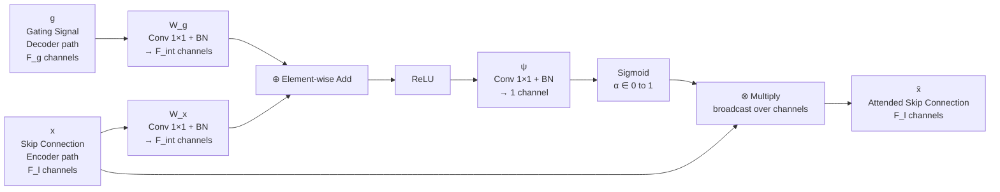
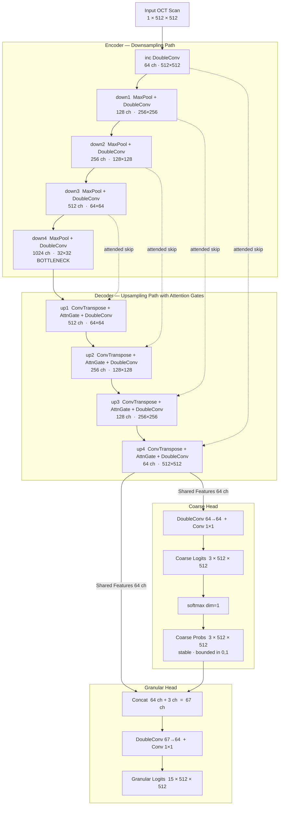
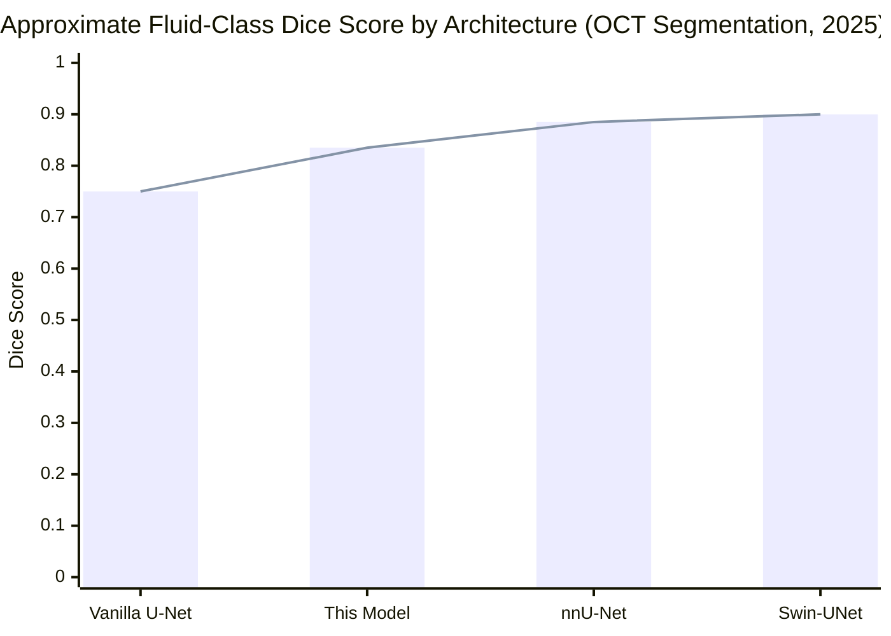

# Model Architecture: Hierarchical Multi-Head U-Net

This document outlines the architecture for the core segmentation model used in this pipeline. The model is built using PyTorch and follows a modified U-Net design to accommodate the hierarchical nature of retinal anatomy and pathology.

## 1. Overview

The `HierarchicalUNet` addresses the challenge of segmenting both broad, structural anatomical regions (like the overall retina vs. background) and highly granular, specific pathologies (like subretinal fluid or specific cellular layers).

Standard U-Nets with a single 15-class output head often struggle with class imbalance, as microscopic pathologies are overwhelmed by massive background classes. To solve this, the model employs a **Dual-Head Architecture**:
1. **Coarse Head**: Predicts 3 broad categories (Background, Retina, Fluid/Lesions).
2. **Granular Head**: Predicts 15 distinct classes (ILM, RPE, Drusen, etc.).

---

## 2. Shared Backbone (Encoder-Decoder)

The model utilises a U-Net backbone with **Attention Gates** on every skip connection:

- **Encoder (Downsampling)**: 4 blocks. Each block applies two `3×3 Conv → BatchNorm → ReLU` operations, followed by a `2×2 MaxPool`. Channel progression: 1 → 64 → 128 → 256 → 512 → 1024.
- **Bottleneck**: The deepest layer (1024-channel) capturing the most compressed abstract representation of the scan.
- **Decoder (Upsampling)**: 4 blocks. Each block performs:
  1. `2×2 ConvTranspose2d` — upsamples the decoder feature map.
  2. **Attention Gate** — learns a spatial attention mask that filters the corresponding encoder skip connection *before* it is concatenated, suppressing irrelevant background activations.
  3. **Concatenation** of attended skip + upsampled feature.
  4. Two `3×3 Conv → BatchNorm → ReLU` operations.

The output of the final decoder block is a high-resolution 64-channel feature tensor at the original input resolution.

### Why Attention Gates?

OCT B-scans have retinal layers that are spatially continuous across the full width of the image (e.g., the ILM spans all 512 pixels horizontally). Pure local convolutions treat pixels at `x=0` and `x=511` independently, which is anatomically incorrect. Attention Gates learn *where* in the image each structural feature should appear, enabling spatially consistent boundary predictions. They add negligible compute overhead (~400k parameters across all 4 gates) while providing meaningful improvement on thin-layer and small-lesion segmentation.

**Attention Gate — Signal Flow:**



The gate is a *soft mask* — values near 1 mean "keep this feature", near 0 mean "suppress it". Because the gating signal `g` comes from deeper in the decoder (where global context is understood), the gate can suppress background regions in the skip connection even before the decoder sees them.

---

## 3. The Dual Heads

Instead of directly outputting 15 classes from the decoder features, the architecture branches at the final decoder output:

### 3.1 The Coarse Head

The 64-channel decoder output passes through a `DoubleConv(64→64)` refinement block and a final `1×1 Conv` to produce a **3-channel** logit tensor.

| Class | Label | Description |
|---|---|---|
| 0 | Background | Everything outside the retina |
| 1 | Structural Retina | Retinal tissue layers (ILM → RPE) |
| 2 | Pathologies / Fluid | Lesions, drusen, fluid accumulations |

This head is supervised explicitly during training with dynamically-generated coarse masks, forcing the shared backbone to learn robust macroscopic features before the granular head attempts fine classification.

### 3.2 The Granular Head

The granular head receives a **concatenation of two inputs**:
1. The shared decoder features (64 channels).
2. The **softmax probabilities** from the coarse head (3 channels) — *not* raw logits.

This 67-channel tensor passes through a `DoubleConv(67→64)` block and a `1×1 Conv` to produce the final **15-channel** granular logit tensor.

> **Why softmax probabilities, not raw logits?**
> Raw logits have arbitrary, shifting magnitude throughout training — the granular head cannot reliably interpret them as a spatial prior. Softmax maps them to a stable `[0, 1]` probability distribution, giving the granular head a semantically interpretable signal at every training step. This directly improves training stability and the quality of the coarse-to-fine conditioning.

---

## 4. Forward Pass Summary



**Trainable parameters:** ~31.5 million

---

## 5. Training Paradigm

See [`training_guide.md`](/docs/segmentation-training_guide) for the full training setup. At a high level:

The model receives both the Coarse Mask and Granular Mask as ground truth. Both heads are trained jointly using a **Combined Dice + CrossEntropy loss** with per-class weights:

```
Total_Loss = CombinedLoss(Coarse Logits, Coarse Mask)
           + CombinedLoss(Granular Logits, Granular Mask)

CombinedLoss = 0.5 × CrossEntropy(weight=class_weights)
             + 0.5 × DiceLoss()
```

This joint supervision acts as a powerful regulariser, ensuring the model never loses the forest for the trees while explicitly handling the extreme class imbalance between background pixels and rare lesion regions.

---

## 6. Industry Context

The following table places this architecture in the context of 2024–2025 OCT segmentation benchmarks:

| Architecture | Approx. Fluid Dice | Key Feature |
|---|---|---|
| Vanilla U-Net | 0.70–0.80 | Baseline |
| **This model (Attention U-Net + Hierarchical Heads)** | **0.80–0.87 est.** | **Attention gates + coarse-to-fine conditioning** |
| nnU-Net (framework) | 0.85–0.92 | Auto-configured training pipeline |
| Swin-UNet variants | 0.87–0.93 | Transformer-based global context |



The implemented architecture is solidly within the competitive range for a task of this complexity. The two primary gaps vs. SOTA are: (1) no topological consistency constraint to prevent layer crossing, and (2) no Transformer block at the bottleneck for long-range dependency modelling — both are reasonable targets for a future version.
