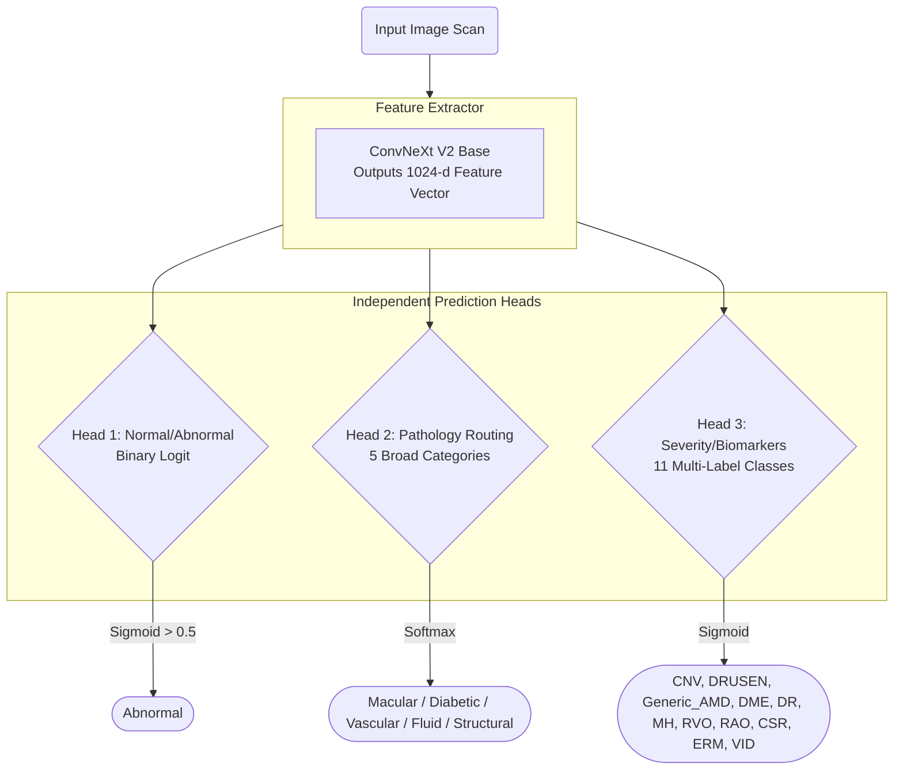

# Multi-Head OCT/OCTA Image Classification Architecture

> [!NOTE]
> **What exactly did we build?**
> We built a **Unified Multi-Head Convolutional Neural Network (CNN)**. 
> It utilizes **Transfer Learning**, taking state-of-the-art image recognition models (ConvNeXt V2) pre-trained on millions of real-world images, and specializing them specifically for medical OCT scan analysis.

Instead of maintaining a complex, multi-model cascade (the old "Gatekeeper -> Router -> Specialist" setup), we unified the entire pipeline into a **single, powerful backbone** that extracts a shared global feature vector, which then feeds into three independent, specialized prediction heads.

---

## 1. The Global Data Flow

Here is the visual representation of how a single input scan flows through our unified pipeline during inference:

---

## 2. Layer-by-Layer Breakdown

### The Backbone (Feature Extractor)
- **Model:** `ConvNeXt V2 Base`
- **Role:** Extracts a rich, highly expressive 1024-dimensional feature vector from the input image. We leverage the power of ConvNeXt V2's Fully Convolutional Masked Autoencoder (FCMAE) pre-training, which significantly improves the model's ability to capture structural representations compared to older architectures like ResNet or EfficientNet.
- **Input Resolution:** `384 x 384` pixels.
  > [!TIP]
  > **Why the higher resolution?** We use 384px because the network needs to look for minute, fine-grained structural details (like micro-aneurysms or small fluid pockets) that might be blurred out at 224px.
- **Grad-CAM Target:** `model.backbone.stages[-1].blocks[-1]` — the final stage block before the global pooling.

### Head 1: Binary Triage (Normal vs Abnormal)
- **Role:** Safely screens out healthy patients. 
- **Output:** 1 Logit (Binary).
- **Activation/Loss:** `Sigmoid` / `BCEWithLogitsLoss`.

### Head 2: Disease Router (Pathology Families)
- **Role:** Categorizes abnormal scans into one of five broad disease families.
- **Output:** 5 Logits.
- **Classes:** `Macular_Degeneration`, `Diabetic_Complications`, `Vascular_Occlusions`, `Structural_Issues`, `Fluid_Accumulation`.
- **Activation/Loss:** `Softmax` / `CrossEntropyLoss`.

### Head 3: Granular Biomarkers (Multi-Label Specialists)
- **Role:** Replaces the old "Specialist" models. It simultaneously predicts the presence of 11 different granular biomarkers/diseases, allowing for multi-morbidity detection (e.g., a patient having both DRUSEN and CNV).
- **Output:** 11 Logits.
- **Classes:** `CNV`, `DRUSEN`, `Generic_AMD`, `DME`, `DR`, `MH`, `RVO`, `RAO`, `CSR`, `ERM`, `VID`.
- **Activation/Loss:** `Sigmoid` / `BCEWithLogitsLoss`.

---

## 3. Preprocessing: CLAHE Scanner Normalization

Before any augmentation or model inference, every image passes through **CLAHE (Contrast Limited Adaptive Histogram Equalization)**. This is a **deterministic** preprocessing step applied identically at train, validation, and test time — it is NOT an augmentation.

**The Problem:** OCT scanners from different manufacturers (Zeiss, Heidelberg, Topcon) produce images with wildly different brightness and contrast profiles. Without normalization, the model learns scanner-specific intensity distributions instead of pathology — a form of shortcut learning that causes the model to fail on any unseen device.

**The Solution:**
- Convert RGB scan to grayscale (OCT diagnostic information is luminance-based; color is redundant).
- Apply CLAHE with `clip_limit=2.0` and `tile_grid=(8, 8)` to equalize local contrast adaptively.
- Stack back to 3-channel RGB (required for pre-trained backbone compatibility).

---

## 4. Training Strategy: Two-Phase Fine-Tuning

Transfer learning can be volatile if done incorrectly. We use a **Phase-based** training loop for the unified Multi-Head model:

1. **Phase 1: Warm-up (Frozen Backbone).** We freeze the stem and the first three stages (Stages 0-2) of the ConvNeXt V2 backbone. We only allow gradients to update Stage 4 and our newly attached multi-head classification MLPs. We do this for the initial epochs.
2. **Phase 2: Fine-tuning (Unfrozen Backbone).** We unfreeze the entire network and drop the learning rate drastically. We allow the CNN to gently adapt its edge-and-texture filters specifically to OCT scans, without destroying the powerful generalized features.

*This documentation reflects the pipeline configuration as of July 2026. The legacy multi-model hierarchy was superseded by the unified Multi-Head ConvNeXt V2 architecture.*
