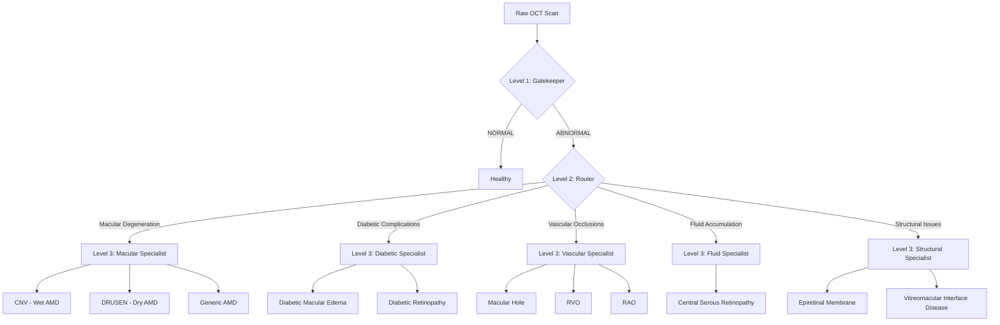

# OCT Hierarchical Classification Pipeline — Architecture Overview

## Motivation

The project aims to classify 86,120 OCT and OCTA scans into 12 fine-grained retinal pathologies. A standard "flat" multi-class model (12 outputs) performs poorly on this dataset due to two major factors:
1. **Extreme Class Imbalance:** Normal/CNV dominate (tens of thousands of images), while RAO, CSR, and VID have fewer than 100 images each.
2. **Pathological Similarity:** Differentiating between early-stage diseases (e.g., Dry AMD vs Wet AMD) requires fine structural details, while distinguishing Normal from Abnormal is a much coarser task.

To address this, we implemented a **3-Level Hierarchical Architecture**, allowing specialized models to focus on specific tasks with tailored resolutions and batch sizes.

## The Hierarchy

### Level 1: The Gatekeeper (Binary)
- **Task:** NORMAL (Healthy) vs ABNORMAL (Pathology Present)
- **Model:** ResNet-50 (Pretrained on ImageNet1K-V2)
- **Input Resolution:** 224×224
- **Rationale:** The Gatekeeper filters out healthy scans quickly and efficiently. Since the decision boundary between healthy and diseased is broad, 224px is sufficient. ResNet-50 provides high throughput and stability.

### Level 2: The Disease Router (5-Class)
- **Task:** Classify ABNORMAL scans into one of 5 broad disease families:
  1. Macular Degeneration
  2. Diabetic Complications
  3. Vascular Occlusions (RAO & RVO aggregated here)
  4. Fluid Accumulation
  5. Structural Issues
- **Model:** EfficientNet-B2
- **Input Resolution:** 224×224
- **Rationale:** EfficientNet-B2 offers a good balance of feature extraction capability and speed. We group visually/clinically related diseases here to simplify the routing logic. For example, RAO and RVO are grouped at this stage to increase the sample pool for the "Vascular" branch.

### Level 3: The Specialists (Fine-Grained)
- **Task:** Differentiate specific diseases within a family (e.g., Wet AMD vs Dry AMD).
- **Models:** 5 separate EfficientNet-B0 models (one for each L2 family).
- **Input Resolution:** 384×384
- **Rationale:** Differentiating between specific pathologies (like CNV vs DRUSEN) requires high-resolution structural details (like small fluid pockets or subretinal deposits). We bump the resolution to 384px. We use EfficientNet-B0 to keep memory requirements in check at this higher resolution.

---

## Architectural Directives & Rules

1. **Strict AMD Separation:** At Level 3 (Macular), we enforce a strict separation between Wet AMD (`CNV`), Dry AMD (`DRUSEN`), and `Generic_AMD`. They are never merged into a single "AMD" class, preserving prognostic value.
2. **Vascular Aggregation/Separation:** At Level 2, Retinal Artery Occlusion (`RAO`) and Retinal Vein Occlusion (`RVO`) are grouped into `Vascular_Occlusions`. At Level 3, the Vascular specialist separates them back out, alongside Macular Hole (`MH`).
3. **Hardware Constraints:** The models are explicitly tuned for Apple Silicon (MPS). Batch sizes and resolutions are calibrated to fit within a 24GB/32GB unified memory envelope.

---

## Data Flow Diagram

