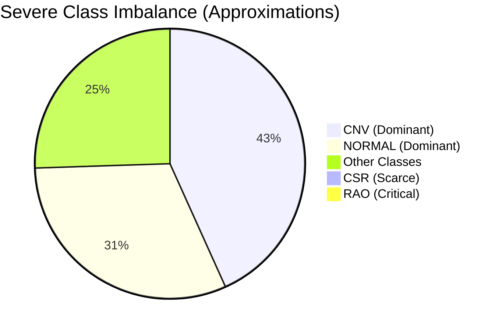
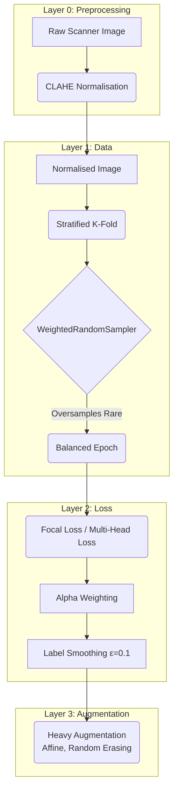

# OCT Pipeline — Data & Imbalance Strategy

## Dataset Composition

The pipeline aggregates data from three disparate sources to form a master dataset of **86,120 OCT/OCTA scans**:
1. Kermany/UCSD dataset
2. OCTDL dataset
3. OCTID dataset

> [!NOTE]
> For complete citations, descriptions, and the specific training/testing split strategy regarding these sources, please refer to the [Dataset Documentation](dataset.md).

This multi-source approach increases generalisation but introduces significant variations in labelling schemas and class distributions. `config/hierarchy.yaml` serves as the single source of truth, mapping raw directory paths to standardized tuples for our multi-head network: `(label_h1, label_h2, label_h3)`.

## The Imbalance Problem

In the medical imaging domain, rare diseases mean scarce data. The class distribution across all fine classes highlights a critical long-tail imbalance:



> [!CAUTION]
> **The Threat of Collapse**
> Training a standard model on this distribution results in the network collapsing: it learns to constantly predict "CNV" and achieves high accuracy by completely ignoring the rare pathologies (like RAO).

## Three-Tiered Imbalance Mitigation

To force the network to learn the rare classes simultaneously across all three heads, we implement a defensive stack across three layers: the DataLoader, the Loss Function, and the Augmentation Pipeline.

## Scanner Normalisation — CLAHE Preprocessing

Before any augmentation or model input, every image passes through **Contrast Limited Adaptive Histogram Equalisation (CLAHE)**. This is a deterministic, non-stochastic preprocessing step — not an augmentation — applied identically at train, val, and test time.

> [!IMPORTANT]
> **Why CLAHE?**
> This dataset aggregates scans from at least three different OCT scanner families (Zeiss Cirrus, Heidelberg Spectralis, Topcon devices). Different scanners produce systematically different base brightness and local contrast levels. Without normalisation, the model may learn scanner-specific intensity distributions as a shortcut rather than pathology — a form of domain leakage that degrades performance when evaluated on scans from an unseen device.

```
clip_limit = 2.0      # Prevents noise amplification in homogeneous regions
tile_grid  = (8, 8)   # Adaptive tiles: independent equalisation per region
```

The output is converted to 3-channel greyscale-stacked RGB, which is required for the ImageNet-pretrained ConvNeXt V2 backbone.

## Three-Tiered Imbalance Mitigation Architecture



### 1. Stratified K-Fold + WeightedRandomSampler (Data Layer)
- **Stratified K-Fold:** We use `sklearn.model_selection.StratifiedKFold(n_splits=5)`. This ensures that even the rarest classes (like the 22 RAO images) are proportionally distributed across all 5 folds. Without stratification, a fold might contain zero RAO images, crashing the AUROC metric.
- **WeightedRandomSampler:** In the training dataloader, we calculate the inverse frequency of each class (`1.0 / count`). We feed these weights to PyTorch's `WeightedRandomSampler`. This changes the sampling probability so that the dataloader oversamples minority classes and undersamples dominant classes, ensuring that *within any given epoch*, the model sees a balanced number of examples from every class.

### 2. Multi-Head Loss + Alpha Weighting (Loss Layer)
Even with balanced sampling, "easy" examples (like classic NORMAL scans) can overwhelm the gradient flow compared to "hard" border-case examples.

> [!TIP]
> **Why Focal Loss for highly imbalanced heads?** 
> The `(1 - p_t)^gamma` modulating factor heavily penalizes confident, correct predictions (driving their loss near zero), while preserving the loss for uncertain or incorrect predictions. This forces the optimizer to spend its energy on the hardest examples.

- **Alpha Weighting:** We pass the normalized class weights as the `alpha` parameter to the loss functions to give a structural baseline boost to minority classes.
- **Label Smoothing (ε=0.1):** Applied to the categorical heads (Head 2, Head 3). Because the datasets come from three different annotator pools, there is inherent label noise (e.g. one dataset's "AMD" might overlap with another's "DRUSEN"). Label smoothing prevents the model from becoming overconfident on noisy annotations.

### 3. Heavy Augmentation (Augmentation Layer)
Since we are oversampling classes with very few images, the model runs a high risk of memorizing them (overfitting). CLAHE is applied first, then spatial augmentations follow.

The unified ConvNeXt V2 architecture uses a large input resolution (`384x384`) and employs aggressive augmentation:
- Stronger affine transformations (rotations, translations, scaling)
- `RandomErasing(p=0.35)`: Cuts out small rectangular patches of the image. This forces the network to look at the *entire* structural context of the retina rather than memorizing a single localized artifact in the scarce RAO/CSR images.

By combining scanner normalisation, sampling probabilities, multi-head loss modulation, and heavy synthetic variation, we maximise the predictive signal extracted from the long-tail minority classes.
