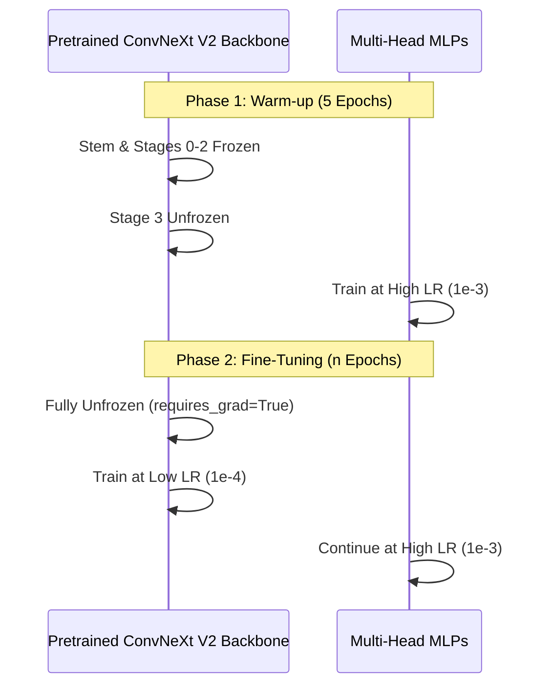

# OCT Pipeline — Training Engine & Optimisations

## Unified Multi-Head Training

Since migrating to the `MultiHeadConvNeXtV2` architecture, the training loop no longer trains separate models for different hierarchy levels. Instead, it trains a single model with three distinct classification heads using a combined loss function.

### Two-Phase Training Protocol

Transfer learning from ImageNet features to grayscale medical OCT scans requires care. If we immediately train the entire network, the large gradients flowing backward from the randomly initialized classifier heads will permanently destroy the useful pretrained convolutional features.

**Phase 1: Warm-up (Head & Final Stage Only)**
- The convolutional backbone's stem and early stages (0-2) are `frozen` (requires_grad = False).
- We train only the final stage (Stage 3) and the classifier heads for the initial epochs using a relatively high learning rate (`1e-3`).
- This allows the randomly initialized heads to "warm up" and orient themselves to the OCT feature space without disrupting the low-level backbone features.

**Phase 2: Fine-Tuning (Full Network)**
- The entire backbone is `unfrozen`.
- We use **differential learning rates**: the classifier heads continue at `1e-3`, but the unfrozen backbone is trained at a much lower rate (`1e-4`).
- This allows the deep convolutional layers to slowly adapt to the unique textures of retinal pathology, while the heads continue to converge rapidly.

### Multi-Head Combined Loss

The network predicts three outputs simultaneously. The total loss is a weighted sum of three independent loss functions:
1. **Head 1 (Binary Normal/Abnormal):** `BCEWithLogitsLoss`
2. **Head 2 (Pathology Routing - 5 Classes):** `CrossEntropyLoss`
3. **Head 3 (Biomarkers - 11 Multi-Label Classes):** `BCEWithLogitsLoss`

$$ \text{Total Loss} = \lambda_1 \text{Loss}_{H1} + \lambda_2 \text{Loss}_{H2} + \lambda_3 \text{Loss}_{H3} $$

### Learning Rate Scheduling & Early Stopping

- **CosineAnnealingWarmRestarts:** During Phase 2, we use a cosine annealing schedule with warm restarts.
- **Early Stopping:** Monitored on the validation loss. If validation loss does not improve for consecutive epochs, training halts.
- **Gradient Clipping:** `max_norm=1.0` is applied before every optimizer step. Focal Loss or combined multi-head losses on heavily imbalanced micro-batches can produce exploding gradients; clipping guarantees stability.

---

## Hardware Optimizations

The training pipeline is aggressively tuned for environments like Google Colab's Free Tier (T4 GPU - 16GB VRAM) and local Apple Silicon (M2 Pro).

### 1. Mixed Precision (AMP `float16`)
- The trainer employs `torch.autocast`.
- **Memory impact:** Halves the activation footprint. This allows us to push the batch size to 16 or 32 within the 16GB memory limit of a T4.
- **Speed impact:** Doubles memory bandwidth efficiency.

### 2. DataLoader Worker Tuning
- `num_workers=4` is set as the default to optimally leverage CPU cores for data loading and heavy Data Augmentation (RandomAffine, Erasing) without stalling the main python process feeding the GPU queue.

---

## The Imbalance Mitigation Engine

Medical datasets are notoriously imbalanced. We implement a **defense mechanism** to force the network to care about rare diseases:

### A. Focal Loss ($\gamma = 2.0$)
Standard Cross-Entropy loss overwhelms the model with easy examples. We replaced it with **Focal Loss**, governed by the mathematical formula:

$$ FL(p_t) = -\alpha_t (1 - p_t)^\gamma \log(p_t) $$

### B. Aggressive Augmentation Pipeline
Because we oversample rare images, the model would normally memorize them and overfit. To prevent this, we apply severe visual distortions dynamically on the fly:
- **RandomAffine:** Shifts, scales, and shears.
- **RandomErasing:** Literally blacks out random rectangles of the image, forcing the CNN to find multiple distinct features for a disease rather than relying on a single artifact.

> [!CAUTION]
> **Mixup & CutMix: Proceed with extreme caution (Disabled).** 
> While state-of-the-art for natural images, they can be highly destructive in medical imaging. CutMix might paste a Macular Hole into a scan of Diabetic Macular Edema, creating an anatomically impossible synthetic anomaly that confuses the model's spatial understanding of retinal layers.
