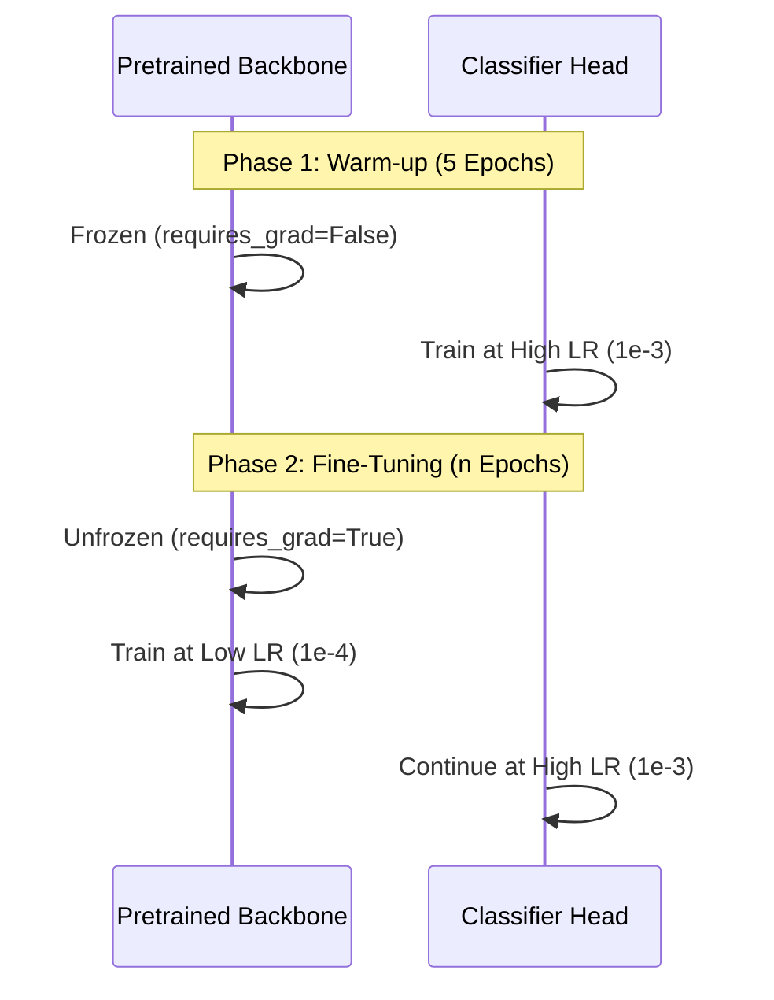
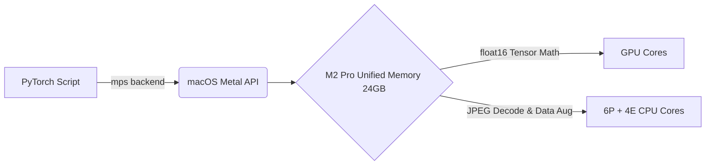
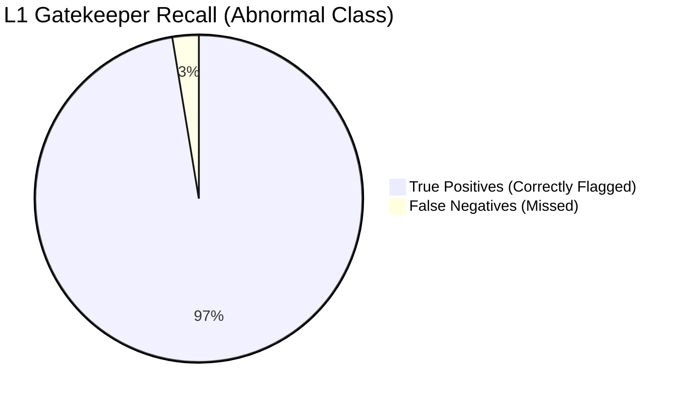

# OCT Pipeline — Training Engine & Optimisations

## The HierarchyTrainer

All levels of the pipeline (Gatekeeper, Router, and Specialists) share a unified training engine (`training/trainer.py`). This engine orchestrates the cross-validation loop and handles all advanced PyTorch integrations.

### Two-Phase Training Protocol

Transfer learning from ImageNet features to grayscale medical OCT scans requires care. If we immediately train the entire network, the large gradients flowing backward from the randomly initialized classifier head will permanently destroy the useful pretrained convolutional features.

**Phase 1: Warm-up (Head Only)**
- The convolutional backbone is `frozen` (requires_grad = False).
- We train only the classifier head for 5 epochs using a relatively high learning rate (`1e-3`).
- This allows the randomly initialized head to "warm up" and orient itself to the OCT feature space without disrupting the backbone.

**Phase 2: Fine-Tuning (Full Network)**
- The backbone is `unfrozen`.
- We use **differential learning rates**: the classifier head continues at `1e-3`, but the unfrozen backbone is trained at a much lower rate (`1e-4`).
- This allows the deep convolutional layers to slowly adapt to the unique textures of retinal pathology, while the head continues to converge rapidly.

### Learning Rate Scheduling & Early Stopping

> [!NOTE]
> **CosineAnnealingWarmRestarts:** During Phase 2, we use a cosine annealing schedule with warm restarts (`T_0=20`, `T_mult=2`). Instead of letting the learning rate decay to zero permanently, it periodically spikes back up. This helps the optimizer escape local minima in the highly non-convex loss landscape typical of imbalanced datasets.

- **Early Stopping:** Monitored on the validation loss with a `patience=10`. If the validation loss stops improving for 10 consecutive epochs, training for that fold halts to prevent overfitting.
- **Gradient Clipping:** `max_norm=1.0` is applied before every optimizer step. Focal Loss on heavily imbalanced micro-batches can occasionally produce exploding gradients; clipping guarantees stability.

---

## Hardware Optimizations (Apple Silicon M2 Pro)

The training pipeline is aggressively tuned for the M2 Pro chip (24GB Unified Memory). Containerization (Docker) is strictly avoided, as the Linux VM overhead prevents access to the Metal Performance Shaders (MPS) backend, resulting in CPU-only fallback and 50–200x slowdowns.

### 1. MPS Backend (Baseline)
The `get_device()` utility automatically selects the `mps` device when running on Mac, utilizing the M2 GPU cores.

### 2. Mixed Precision (AMP `float16`)
- Apple Silicon native GPUs excel at `float16` matrix math.
- The trainer employs `torch.autocast(device_type='mps', dtype=torch.float16)`.
- **Memory impact:** Halves the activation footprint. This allows us to push the L1 batch size to 48 and the L2 batch size to 32 within the 24GB memory limit (leaving ~5GB overhead for macOS).
- **Speed impact:** Doubles memory bandwidth efficiency (the main bottleneck on M2 Pro is the 200 GB/s bandwidth limit).
- Note: MPS does not support `GradScaler`. The forward pass runs in `float16`, but the loss and gradients are computed in `float32`.

### 3. torch.compile() (Disabled)
> [!WARNING]
> **Why is `torch.compile` disabled?**
> Extensive benchmarking revealed that the Inductor backend attempts to target CUDA SMs. Since they don't exist on MPS, it falls back to a generic tracing path that *adds* overhead without fusing kernels, resulting in a **12x slowdown** on M2 Pro.

### 4. DataLoader Worker Tuning
- `num_workers=4` is set as the default. The M2 Pro chip has a 6P + 4E core configuration. Using 4 worker processes optimally leverages the performance cores for JPEG decoding and heavy Data Augmentation (RandomAffine, Erasing) without stalling the main python process feeding the MPS queue.

---

## Level 1 Gatekeeper Results & False Negative Analysis

The Level 1 Gatekeeper (NORMAL vs ABNORMAL) completed a stratified 5-fold cross-validation with the following metrics:
- **val_accuracy**: 0.9799 ± 0.0030
- **val_auroc**: 0.9977 ± 0.0004
- **val_macro_f1**: 0.9769 ± 0.0034

### False Negative Rate (FNR)

> [!IMPORTANT]
> In medical classification, a False Negative (predicting a sick patient as healthy) is significantly more dangerous than a False Positive (flagging a healthy patient for review). 

Across all 5 folds, the model achieved an average **Recall of 97.4%** on the ABNORMAL class (the positive class).
- **False Negative Rate**: **2.6%**
- **Absolute impact**: Out of ~11,853 true ABNORMAL scans per fold, the model correctly catches ~11,545 and misses roughly 308.

For a raw baseline threshold (50% probability), a 2.6% FNR is an exceptionally strong first pass. During production deployment, this FNR can be driven even lower by applying threshold calibration (e.g., lowering the threshold to 20%, enforcing a highly cautious decision boundary at the slight expense of false positives).

---

## Synthetic Augmentation Assessment (Level 2 & 3)

Minority classes such as Vascular Occlusions, Fluid Accumulation, and Structural Issues are extremely underrepresented at Level 2. Aggressive oversampling + augmentation + class-weighted loss is mandatory to prevent the router from collapsing.

Here is the medical assessment of how synthetic strategies map to ophthalmic imaging:

**The Baseline Defenses**
- **Class-Weighted Loss & Oversampling**: Utilizing PyTorch's `WeightedRandomSampler` alongside `CrossEntropyLoss` weights is the mandatory 1-2 punch.
- **Traditional Augmentations**: Aggressive but anatomically valid geometric transformations (horizontal flips, slight rotations, elastic deformations) are safe and effective.

**The Synthetic Augmentation Caveats**
- **Random Erasing (Cutout)**: *Highly Recommended*. By randomly masking parts of the scan, you force the ResNet-50 backbone to look for distributed features of Vascular Occlusions or Fluid Accumulation rather than hyper-fixating on a single distinct artifact. It dramatically improves robustness.

> [!CAUTION]
> **Mixup & CutMix: Proceed with extreme caution (Disabled).** 
> While state-of-the-art for natural images, they can be highly destructive in medical imaging.
> - **CutMix** might paste a Macular Hole into a scan of Diabetic Macular Edema, creating an anatomically impossible synthetic anomaly that confuses the model's spatial understanding of retinal layers.
> - **Mixup's** pixel-blending can wash out the subtle contrast differences and boundary lines necessary to spot tiny fluid pockets or early-stage structural tearing.

**Strategy**: To use advanced augmentation for the minority classes, Random Erasing combined with aggressive contrast and brightness jittering is the safest way to synthetically expand those small sample sizes without destroying the clinical ground truth.
