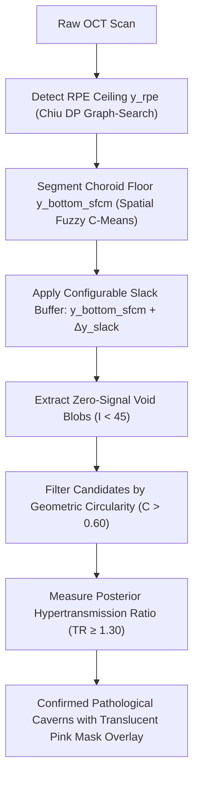

# Choroidal Cavern Detection & Soft-Trust Slack Buffer Architecture

## 1. Overview & Optical Physics

On OCT B-scans, the choroid is primarily composed of vascular lumens embedded within interstitial stroma. Differentiating normal choroidal blood vessels from pathological choroidal caverns/cavitations requires modeling their distinct optical signatures:

---

## 2. Optical Signatures Comparison

| Optical Dimension | Normal Choroidal Blood Vessels (Haller / Sattler) | Pathological Choroidal Caverns / Holes |
|---|---|---|
| **Lumen Intensity** | Hyporeflective ($I \approx 10\text{--}30$) due to RBC scattering | Completely empty signal void ($I \approx 0\text{--}10$) |
| **Wall / Boundary** | **Hyperreflective collagenous vessel sheath** ($\nabla I_{wall} > 0$) | **No structural wall** (abrupt tissue interface) |
| **Posterior Shadowing vs Transmission** | **Shadow plume / attenuation** ($\mathcal{T}_{sub} \le 1.0$) | **Posterior hypertransmission / 'Lighthouse' effect** ($\mathcal{T}_{sub} \ge 1.30$) |
| **Visual Dashboard Overlay** | Background stroma matrix | **Translucent Pink Mask** (`#ff1493` with `rgba(255, 64, 160, 0.40)`) |

---

## 3. Mathematical Formulations

### A. Augmented Choroid ROI with Soft-Trust Slack Buffer
Because Spatial Fuzzy C-Means (SFCM) can underestimate the true depth of the choroid in atrophic or cavernous scans, a downward safety trust buffer $\Delta y_{\text{slack}}$ is applied:

$$\Omega_{\text{search}}(x) = \left\{ (y, x) \;\middle|\; y_{\text{rpe}}(x) + 2 \le y \le \min\left(H - 1, \; y_{\text{bottom\_sfcm}}(x) + \Delta y_{\text{slack}}\right) \right\}$$

### B. Geometric Circularity Metric
For each candidate void contour of area $\mathcal{A}$ and perimeter $\mathcal{P}$:
$$\mathcal{C} = \frac{4 \pi \cdot \mathcal{A}}{\mathcal{P}^2} \quad (\text{Valid cavern if } \mathcal{C} \ge 0.60)$$

### C. Posterior Hypertransmission Ratio ($\mathcal{T}_{sub}$)
$$\mathcal{T}_{sub} = \frac{\frac{1}{\Delta h \cdot w} \sum_{y=y_0+h}^{y_0+h+\Delta h} \sum_{x=x_0}^{x_0+w} I(y, x)}{\max\left(1.0, \; \bar{I}_{\text{lateral\_ref}}\right)}$$
- If $\mathcal{T}_{sub} \ge 1.30$, unobstructed laser transmission confirms a true empty cavity.
- If $\mathcal{T}_{sub} < 1.0$, shadow absorption indicates a normal blood vessel.

---

## 4. Configuration Schema

| Parameter | Key | Range & Step | Default | Purpose |
|---|---|---|---|---|
| **Choroid Slack Buffer** | `sfcm_slack_bottom_px` | `0` – `60` px (step `2`) | `20` px | Downward safety extension buffer extending past the SFCM floor. |
| **Transmission Threshold** | `cavern_transmission_threshold` | `1.1` – `2.0` (step `0.05`) | `1.30` | Minimum posterior hypertransmission ratio required to classify a hole as a cavern. |
| **Min Cavern Area** | `cavern_min_area` | `5` – `100` px | `15` px | Minimum pixel area for candidate lesion blobs. |
| **Min Circularity** | `cavern_min_circularity` | `0.4` – `0.9` | `0.60` | Minimum roundness score to filter out non-circular interstitial gaps. |

---

## 5. Related Documentation

For the full specification of general choroidal hole segmentation, Euclidean Distance Transform Watershed cluster decomposition, and sub-pixel boundary refinement, see:
- [`CHOROIDAL_HOLES_AND_LUMEN_DETECTION.md`](file:///Users/nikhilmundhra/Documents/Github/OCT-Analyser-Capstone/training/classification/data/preprocessing/CHOROIDAL_HOLES_AND_LUMEN_DETECTION.md)
