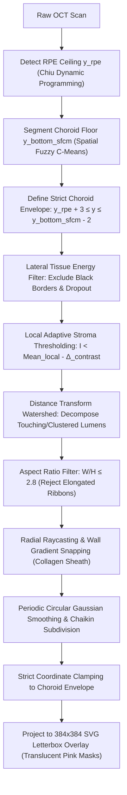

# Choroidal Hole & Vascular Lumen Detection Architecture

## 1. Overview & Optical Physics

On Optical Coherence Tomography (OCT) B-scans, the choroid is a dense, highly vascular layer situated directly beneath the Retinal Pigment Epithelium (RPE) and Bruch's Membrane. It consists of:
1. **Choriocapillaris**: High-density micro-capillary layer directly below the RPE.
2. **Sattler's Layer**: Medium-diameter arterioles and venules.
3. **Haller's Layer**: Deep, large-diameter vascular lumens resting against the suprachoroidea and sclera.

### Optical Signatures



| Anatomical Structure | Optical Reflectivity | Boundary Characteristics | Posterior Optical Effect |
| :--- | :--- | :--- | :--- |
| **Vascular Lumen (Haller / Sattler)** | **Hyporeflective** ($I \approx 10\text{--}40$) due to RBC absorption | **Hyperreflective collagen sheath wall** ($\nabla I_{\text{wall}} > 0$) | Subtle shadow beam ($\mathcal{T} \le 1.0$) |
| **Choroidal Cavern / Cavitation** | **Signal Void** ($I \approx 0\text{--}10$) | **No structural wall** (sharp tissue gap) | Posterior hypertransmission ($\mathcal{T} \ge 1.30$) |
| **Choroidal Stroma Matrix** | **Intermediate to High** ($I \approx 50\text{--}140$) | Fibrous, reflective interstitial collagen | Base background signal |
| **Scan Background / Dropout** | **Zero Intensity** ($I = 0$) | Non-tissue scan margins | Total signal void |

---

## 2. End-to-End Algorithmic Pipeline

### Step 1: Strict Choroidal Envelope & Zero-Spill Invariant

To guarantee that zero hole pixels or polygon vertices can ever leak into the neurosensory retina or outer sclera, the search region is strictly bounded:

$$\Omega_{\text{choroid}} = \left\{ (x, y) \;\middle|\; x_{\min\_tissue} \le x \le x_{\max\_tissue}, \; y_{\text{rpe}}(x) + 3 \le y \le y_{\text{bottom\_sfcm}}(x) - 2 \right\}$$

- **Lateral Tissue Energy Check**: Scans column-wise energy $\sum_{y} [I(x, y) > 35] > 25$ to determine $[x_{\min\_tissue}, x_{\max\_tissue}]$, discarding outer dark borders and lateral signal dropouts.
- **Tissue Enclosure Invariant**: Pixels with $I = 0$ touching image borders are excluded to prevent background voids from being misclassified as lumens.

---

### Step 2: Upstream Despeckling & Robust Local Median Baseline

To decouple noise suppression from anatomical thresholding, the pipeline applies upstream despeckling before computing background baselines:

1. **Edge-Preserving Bilateral & Median Filtering**:
   - An edge-preserving bilateral filter ($d=7, \sigma_{\text{color}}=40, \sigma_{\text{space}}=5$) and $3\times 3$ median filter are applied strictly inside $\Omega_{\text{choroid}}$.
   - Suppresses high-frequency Rayleigh speckle noise while preserving steep hyperreflective vessel wall gradients.

2. **Speckle-Immune Local Median Baseline**:
   - Replaced moving box mean with a **2D Local Median Filter** ($W_{\text{local}} \in [5, 61]$ px).
   - Moving box means are easily dragged down by nearby speckle dips. A moving median is robust against local speckle contamination, stabilizing the contrast cutoff across varying scan illumination profiles:

$$\mathcal{M}_{\text{lumen}}(x, y) = \begin{cases} 1, & \text{if } I_{\text{denoised}}(x, y) < \left( \text{Median}_{\text{local}}(x, y) - \Delta_{\text{contrast}} \right) \;\land\; (x, y) \in \Omega_{\text{choroid}} \;\land\; I(x, y) > 0 \\ 0, & \text{otherwise} \end{cases}$$

3. **Multi-Gate Shape & Compactness Validation**:
   - **Solidity**: $\mathcal{S} = \frac{\text{Area}}{\text{Area}(\text{ConvexHull})} \ge 0.60$ (rejects fragmented speckle clusters).
   - **Isoperimetric Circularity**: $\mathcal{C} = \frac{4\pi \text{Area}}{\text{Perimeter}^2} \ge 0.25$ (rejects jagged noise remnants).
   - **Aspect Ratio**: $\max(W/H, H/W) \le 2.8$ (rejects elongated layer ribbons).

---

### Step 3: Distance Transform & Marker-Controlled Watershed Decomposition

When multiple adjacent vessels touch or cluster together, standard thresholding produces an elongated merged connected component. Instead of discarding these regions, the algorithm decomposes them into their individual constituent lumens:

1. **Euclidean Distance Transform**:
   $$D(x, y) = \min_{(x', y') \notin \mathcal{M}} \sqrt{(x - x')^2 + (y - y')^2}$$
2. **Centroid Seed Detection**: Identifies local distance maxima:
   $$\mathcal{S} = \left\{ (x, y) \;\middle|\; D(x, y) \ge 0.38 \cdot \max_{(u, v)} D(u, v) \right\}$$
3. **Marker-Controlled Watershed**: Floods outward from each seed marker $\mathcal{S}_i$ along distance ridge lines to separate touching vessels without altering their individual anatomical profiles.
4. **Morphological Isthmus Separation**: When peak seeds are tightly connected, morphological erosion with a $3\times 3$ elliptical kernel disconnects narrow connecting bridges and dilates each sub-lumen back to its true boundaries.

---

### Step 4: Aspect Ratio & Geometric Invariants

True choroidal vessels and caverns are circular, oval, or mildly elliptical in cross-section. Abnormally elongated ribbons (e.g., horizontal layer artifacts) are filtered out:

$$\text{Ratio}_{\text{horizontal}} = \frac{\text{Width}}{\max(1, \text{Height})}, \quad \text{Ratio}_{\text{vertical}} = \frac{\text{Height}}{\max(1, \text{Width})}$$

$$\text{Valid Candidate} \iff \max\left(\text{Ratio}_{\text{horizontal}}, \; \text{Ratio}_{\text{vertical}}\right) \le \text{Max Aspect Ratio} \quad (\text{Default: } 2.8)$$

---

### Step 5: Sub-Pixel Radial Raycasting & Wall Gradient Snapping

To eliminate stair-step pixelation and snap contours directly to the hyperreflective collagen vessel sheath:

1. **Centroid Calculation**: Computes center of mass $(c_x, c_y)$ and polar coordinates for $N = 36$ angles $\theta \in [-\pi, \pi)$.
2. **Outward Gradient Snapping**: Searches along each ray within $[0.75 \cdot r_{\text{init}}, 1.25 \cdot r_{\text{init}}]$ for the maximum outward directional gradient:
   $$\max_{r} \left( \nabla I(c_x + r\cos\theta, \; c_y + r\sin\theta) \cdot \begin{bmatrix} \cos\theta \\ \sin\theta \end{bmatrix} \right)$$
3. **Periodic Circular Gaussian Smoothing**: Applies a 1D Gaussian circular filter ($G_{\sigma=1.4}$) over $r(\theta)$ with wrap-around boundary conditions to ensure $C^1$ continuity.
4. **Chaikin Subdivision**: Performs iterative corner-cutting subdivision along vertex tangents:
   $$Q_i = \frac{3}{4} P_i + \frac{1}{4} P_{i+1}, \quad R_i = \frac{1}{4} P_i + \frac{3}{4} P_{i+1}$$
5. **Strict Boundary Clamping**: Every refined vertex $(x_v, y_v)$ is validated against $\Omega_{\text{choroid}}$. If any vertex strays outside, it is clamped along its centroid ray.

---

## 3. Parameter Schema & UI Reference

All parameters are configurable via the **`● Choroid Holes Detector`** dropdown menu on the calibration dashboard and stored in `folder_params.json`:

| Parameter Label | JSON Key | Type | Range / Step | Default | Technical Description |
| :--- | :--- | :--- | :--- | :--- | :--- |
| **Min Hole Area** | `hole_min_area` | `int` | `5` – `200` px (step `5`) | `25` px | Minimum pixel area for a candidate void, filtering out micro-speckle artifacts. |
| **Max Hole Area** | `hole_max_area` | `int` | `500` – `25000` px (step `500`) | `15000` px | Maximum pixel area for an individual lumen or large fused macro-vessel cluster. |
| **Lumen Contrast Threshold** | `hole_contrast_offset` | `int` | `2` – `25` (step `1`) | `8` | Minimum intensity drop below local stroma mean required to classify as a void. |
| **Local Context Window** | `hole_local_window` | `int` | `5` – `61` px (step `2`) | `15` px | Neighborhood window size ($W_{\text{local}}$) for computing local background mean. |
| **Max Aspect Ratio (W/H)** | `hole_max_aspect_ratio` | `float` | `1.2` – `5.0` (step `0.1`) | `2.8` | Maximum permissible width-to-height ratio, enforcing circular/oval lumen shapes. |

---

## 4. Visualization & SVG Overlay Rendering

The segmented contours are projected into the $384 \times 384$ letterbox coordinate space and rendered as SVG polygon paths:

```html
<path class="choroid-hole-mask"
      d="M 120.5,226.5 L 122.0,227.0 L ... Z"
      fill="rgba(255, 20, 147, 0.65)"
      stroke="#ff007f"
      stroke-width="1.5"
      filter="url(#holeGlow)" />
```

- **Fill**: Translucent deep pink (`rgba(255, 20, 147, 0.65)`).
- **Stroke**: High-contrast magenta outline (`#ff007f`, width `1.5px`).
- **Glow Filter**: Gaussian blur glow (`stdDeviation="1.5"`) for clear clinical visualization against dark OCT scans.
